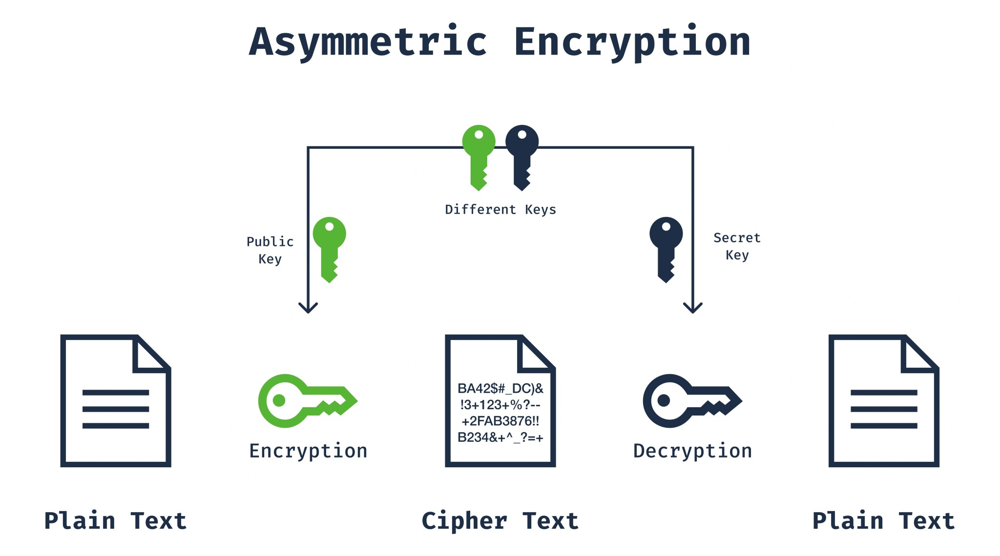

অ্যাসিমেট্রিক এনক্রিপশন হলো এমন একটি এনক্রিপশন পদ্ধতি যেখানে এনক্রিপশন ও ডিক্রিপশন প্রক্রিয়ায় দুইটি ভিন্ন key ব্যবহার করা হয়। এই key দুটিকে বলা হয় Public Key এবং Private Key। Public Key সবার জন্য উন্মুক্ত থাকে, আর Private Key শুধুমাত্র এর মালিক জানেন এবং সুরক্ষিতভাবে সংরক্ষণ করেন। সিমেট্রিক এনক্রিপশনের তুলনায় অ্যাসিমেট্রিক এনক্রিপশন বেশি নিরাপদ হলেও এর গতি তুলনামূলকভাবে ধীর।

## Asymmetric Encryption Algorithms

**১. RSA (রিভেস্ট–শামির–অ্যাডেলম্যান)**
- ১৯৭৭ সালে রন রিভেস্ট, আদি শামির এবং লিওনার্ড অ্যাডেলম্যান কর্তৃক উন্নয়ন করা হয়।
- এনক্রিপশন এবং ডিজিটাল স্বাক্ষর—উভয় কাজেই ব্যবহৃত হয়।
- ১০২৪, ২০৪৮ এবং ৪০৯৬-বিট কী দৈর্ঘ্য সমর্থন করে।
- এর নিরাপত্তা বড় মৌলিক সংখ্যার গুণনীয়ক নির্ণয়ের জটিলতার ওপর ভিত্তি করে।

**২.  ECC (এলিপটিক কার্ভ ক্রিপ্টোগ্রাফি)**
- এলিপটিক কার্ভ তত্ত্বের ওপর ভিত্তি করে তৈরি।
- RSA-এর সমতুল্য নিরাপত্তা প্রদান করে, তবে তুলনামূলকভাবে ছোট key দৈর্ঘ্যে (যেমন, ২৫৬-বিট ECC key প্রায় ২০৪৮-বিট RSA key-এর সমান নিরাপত্তা দেয়)।
- কম কম্পিউটেশনাল শক্তি প্রয়োজন হয়, তাই মোবাইল ও IoT ডিভাইসের জন্য এটি উপযোগী।

**৩. এলগামাল (ElGamal)**
- ১৯৮৫ সালে তাহের এলগামাল কর্তৃক উন্নয়ন করা হয়।
- এনক্রিপশন ও ডিজিটাল স্বাক্ষর—উভয় ক্ষেত্রেই ব্যবহার করা যায়।
- এর নিরাপত্তা ডিসক্রিট লগারিদম সমস্যা সমাধানের জটিলতার ওপর নির্ভর করে।

**৪. DSA (ডিজিটাল সিগনেচার অ্যালগরিদম)**
- ১৯৯১ সালে NIST কর্তৃক ডিজিটাল স্বাক্ষরের জন্য মান হিসেবে প্রণীত হয়।
- শুধুমাত্র ডিজিটাল স্বাক্ষর তৈরি ও যাচাইয়ের জন্য ব্যবহৃত হয়।
- এর নিরাপত্তা ডিসক্রিট লগারিদম সমস্যা সমাধানের জটিলতার ওপর ভিত্তি করে।

## Advantages and Disadvantages of Asymmetric Encryption

### Advantages

- **কী বিতরণ (Key Distribution):** অ্যাসিমেট্রিক এনক্রিপশন সিমেট্রিক এনক্রিপশনের কী বিতরণ সংক্রান্ত সমস্যাগুলো সমাধান করে। পাবলিক কী সবার সাথে শেয়ার করা যায়, আর প্রাইভেট কী মালিকের কাছেই সংরক্ষিত থাকে।
- **নিরাপত্তা (Security):** দুইটি কী ব্যবহারের ফলে সিস্টেমের নিরাপত্তা আরও শক্তিশালী হয়।
- **প্রমাণীকরণ (Authentication):** ডিজিটাল স্বাক্ষর ও সার্টিফিকেটের মাধ্যমে প্রমাণীকরণ সুবিধা প্রদান করে।

### Disadvantages

- **কর্মক্ষমতা (Performance):** অ্যাসিমেট্রিক এনক্রিপশন অ্যালগরিদম সিমেট্রিক এনক্রিপশনের তুলনায় ধীর।
- **কম্পিউটেশনাল শক্তি (Computational Power):** এতে বেশি কম্পিউটেশনাল রিসোর্স প্রয়োজন হয়।

## Public Key Infrastructure (PKI)

পাবলিক কী ইনফ্রাস্ট্রাকচার (PKI) ডিজিটাল সার্টিফিকেট এবং সার্টিফিকেট অথরিটি (CA) ব্যবহার করে নিরাপদভাবে পাবলিক কী বিতরণ ও ব্যবস্থাপনা করে। PKI-এর প্রধান উপাদানগুলো হলো:

**১. সার্টিফিকেট অথরিটি (Certificate Authorities – CA)**
- এমন সংস্থা যারা ডিজিটাল সার্টিফিকেটের মাধ্যমে পাবলিক কী যাচাই ও সুরক্ষিত করে।
- সার্টিফিকেটের স্বাক্ষর প্রদান (signing) এবং বাতিলকরণ (revocation) কার্য সম্পাদন করে এর বৈধতা নিশ্চিত করে।

**২. রেজিস্ট্রেশন অথরিটি (Registration Authorities – RA)**
- সার্টিফিকেট অথরিটির পক্ষে ব্যবহারকারীর প্রমাণীকরণ ও নিবন্ধন সংক্রান্ত কার্যক্রম পরিচালনা করে।

**৩. ডিজিটাল সার্টিফিকেট (Digital Certificates)**
- ব্যবহারকারী বা ডিভাইসের পাবলিক কী এবং পরিচয়সংক্রান্ত তথ্য ধারণকারী ডিজিটাল নথি।
- সার্টিফিকেট অথরিটি কর্তৃক স্বাক্ষরিত ও যাচাইকৃত হয়।

**৪. সার্টিফিকেট রিপোজিটরি (Certificate Repositories)**
- যেখানে ডিজিটাল সার্টিফিকেট সংরক্ষণ ও ব্যবস্থাপনা করা হয় এমন ডেটাবেস।

## Digital Signatures

ডিজিটাল স্বাক্ষর sender এর পরিচয় যাচাই করতে এবং কোনো ডকুমেন্ট বা বার্তার ইন্টিগ্রিটি নিশ্চিত করতে ব্যবহৃত হয়। সাধারণত ডিজিটাল স্বাক্ষর অ্যাসিমেট্রিক এনক্রিপশন অ্যালগরিদম ব্যবহার করে তৈরি করা হয়।

**১. ডিজিটাল স্বাক্ষর তৈরি করা**
- ডাকুমেন্টের একটি হ্যাশ মান গণনা করা হয়।
- সেই হ্যাশ মান sender-এর প্রাইভেট কী দিয়ে এনক্রিপ্ট করা হয়, যার ফলে ডিজিটাল স্বাক্ষর তৈরি হয়।

**২. ডিজিটাল স্বাক্ষর যাচাই করা**
- Receiver নথির হ্যাশ মান পুনরায় গণনা করে।
- Receiver, sender-কে পাবলিক কী ব্যবহার করে Digital Signature Decrypt করে এবং প্রাপ্ত হ্যাশ মানের সাথে তুলনা করে।
- যদি দুইটি হ্যাশ মান একই হয়, তাহলে Document এর integrity ও sender identity যাচাই হয়।

## Applications of Asymmetric Encryption

**১. SSL/TLS**
ওয়েব ব্রাউজার ও সার্ভারের মধ্যে যোগাযোগ নিরাপদ করতে ব্যবহৃত হয়।
ওয়েবসাইটের প্রমাণীকরণ এবং ডেটার integrity নিশ্চিত করে।

**২. ইমেইল নিরাপত্তা (Email Security)**
PGP (Pretty Good Privacy) এবং S/MIME (Secure/Multipurpose Internet Mail Extensions) প্রোটোকল ব্যবহার করে ইমেইল এনক্রিপশন ও ডিজিটাল স্বাক্ষর প্রদান করা হয়।

**৩. VPN (ভার্চুয়াল প্রাইভেট নেটওয়ার্ক)**
দূরবর্তী নেটওয়ার্কগুলোর মধ্যে নিরাপদ যোগাযোগ নিশ্চিত করে।

**৪. ডিজিটাল সার্টিফিকেট ও প্রমাণীকরণ (Digital Certificates and Authentication)**
ই-কমার্স, ব্যাংকিং এবং অন্যান্য ডিজিটাল সেবায় ব্যবহারকারীর পরিচয় যাচাইয়ের জন্য ব্যবহৃত হয়।

**৫. ফাইল ও ডেটা এনক্রিপশন (File and Data Encryption)**
সেনসিটিভ ডেটার নিরাপদ সংরক্ষণ(Secure Storage) ও প্রেরণ (transmission) নিশ্চিত করে।
