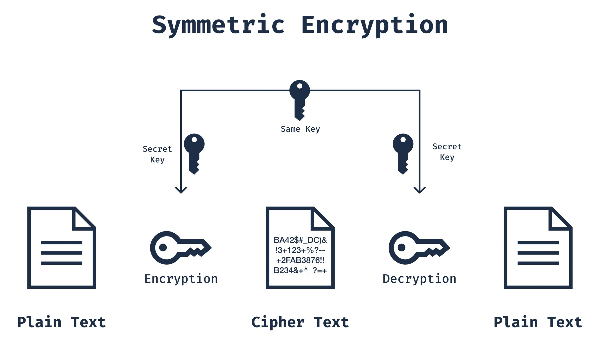

# Symmetric Encryption

সিমেট্রিক এনক্রিপশন হলো এমন একটি এনক্রিপশন পদ্ধতি যেখানে এনক্রিপশন ও ডিক্রিপশন—উভয় কাজের জন্য একই Key ব্যবহার করা হয়। এই পদ্ধতিতে Sender ও Receiver উভয়েই একটি গোপন Key শেয়ার করে, যা ডেটা এনক্রিপ্ট ও ডিক্রিপ্ট করতে ব্যবহৃত হয়। সিমেট্রিক এনক্রিপশন দ্রুত এবং কার্যকর হলেও Key বিতরণ ও ব্যবস্থাপনার ক্ষেত্রে কিছু চ্যালেঞ্জের সম্মুখীন হতে হয়।

## Symmetric Encryption Algorithms

সিমেট্রিক এনক্রিপশন অ্যালগরিদমকে প্রধানত দুইটি শ্রেণিতে ভাগ করা যায়: ব্লক সাইফার (Block Cipher) এবং স্ট্রিম সাইফার (Stream Cipher)।

### **Block Ciphers**

ব্লক সাইফার নির্দিষ্ট আকারের ব্লকে ডেটা প্রক্রিয়াকরণ করে এবং একটি নির্দিষ্ট অ্যালগরিদম ও key ব্যবহার করে প্রতিটি ব্লকের ওপর এনক্রিপশন ও ডিক্রিপশন কাজ সম্পাদন করে।

**১. DES (Data Encryption Standard)**

- ১৯৭০-এর দশকে IBM দ্বারা উন্নয়ন করা হয় এবং ১৯৭৭ সালে যুক্তরাষ্ট্র সরকার এটিকে একটি মান (standard) হিসেবে গ্রহণ করে।
- এতে ৫৬-বিট key দৈর্ঘ্য ব্যবহার করা হয়।
- অপর্যাপ্ত নিরাপত্তার কারণে বর্তমানে এটি আর ব্যাপকভাবে ব্যবহৃত হয় না।

**২. 3DES (ট্রিপল DES)**

- DES-এর নিরাপত্তাজনিত দুর্বলতা সমাধানের জন্য উন্নয়ন করা হয়।
- এতে DES অ্যালগরিদম তিনবার প্রয়োগ করা হয় (এনক্রিপ্ট–ডিক্রিপ্ট–এনক্রিপ্ট)।
- এতে ১৬৮-বিট key দৈর্ঘ্য ব্যবহৃত হয়।

**৩. AES (Advanced Encryption Standard)**

- ২০০১ সালে NIST (National Institute of Standards and Technology) কর্তৃক একটি মান হিসেবে গৃহীত হয়।
- ১২৮, ১৯২ এবং ২৫৬-বিট কী দৈর্ঘ্য সমর্থন করে।
- উচ্চ নিরাপত্তা ও দ্রুতগতির কারণে এটি বর্তমানে ব্যাপকভাবে ব্যবহৃত হয়।

### Stream Ciphers

স্ট্রিম সাইফার ডেটাকে বিট বা বাইটের ধারাবাহিক প্রবাহ হিসেবে প্রক্রিয়াকরণ করে এবং সেই ডেটা স্ট্রিমের ওপর এনক্রিপশন ও ডিক্রিপশন কাজ সম্পাদন করে। এই পদ্ধতিটি বিশেষভাবে ডেটা স্ট্রিম এনক্রিপ্ট করার জন্য উপযোগী।

**১. RC4 (Rivest Cipher 4)**

- ১৯৮৭ সালে রন রিভেস্ট কর্তৃক উন্নয়ন করা হয়।
- এতে পরিবর্তনশীল (variable) key দৈর্ঘ্য ব্যবহার করা যায়।
- দ্রুত ও সহজ হলেও এতে কিছু নিরাপত্তাজনিত দুর্বলতা রয়েছে।

**২. Salsa20 এবং ChaCha20**

- নিরাপদ ও দ্রুত স্ট্রিম সাইফার।
- কম শক্তি খরচ প্রয়োজন এমন পরিবেশে, যেমন মোবাইল ও IoT ডিভাইসে, এগুলো বেশি ব্যবহৃত হয়।

## Advantages and Disadvantages of Symmetric Encryption

### Advantages

- **গতি (Speed):** সিমেট্রিক এনক্রিপশন অ্যালগরিদম অ্যাসিমেট্রিক এনক্রিপশন অ্যালগরিদমের তুলনায় অনেক দ্রুত।
- **দক্ষতা (Efficiency):** এতে তুলনামূলকভাবে কম কম্পিউটেশনাল রিসোর্স প্রয়োজন হয়।
- **সহজতা (Simplicity):** অ্যালগরিদম ও এর বাস্তবায়ন সাধারণত সহজ হয়।

### Disadvantages

- **কী বিতরণ (Key Distribution):** কী নিরাপদভাবে শেয়ার ও বিতরণ করা একটি চ্যালেঞ্জিং কাজ।
- **কী ব্যবস্থাপনা (Key Management):** বিশেষ করে বড় নেটওয়ার্কে বিপুল সংখ্যক কী পরিচালনা করা জটিল হয়ে ওঠে।
- **নিরাপত্তা (Security):** যদি কী ফাঁস হয়ে যায়, তাহলে এনক্রিপ্ট করা সমস্ত ডেটা ঝুঁকির মধ্যে পড়ে।

## **Block Cipher Modes of Operation**

নিরাপত্তা ও কর্মক্ষমতা বৃদ্ধি করার জন্য ব্লক সাইফার বিভিন্ন অপারেশন মোডে ব্যবহার করা যেতে পারে।

### **১. ECB (ইলেকট্রনিক কোডবুক) মোড**

- প্রতিটি ব্লক আলাদাভাবে এনক্রিপ্ট করা হয়।
- একই ধরনের প্লেইনটেক্সট ব্লক থেকে একই ধরনের সাইফারটেক্সট ব্লক তৈরি হয়।
- প্যাটার্ন পুনরাবৃত্তির ঝুঁকি থাকায় এটি নিরাপদ নয়।

### **২. CBC (সাইফার ব্লক চেইনিং) মোড**

- এনক্রিপশনের আগে প্রতিটি ব্লককে আগের সাইফারটেক্সট ব্লকের সাথে XOR করা হয়।
- প্রথম ব্লকের জন্য একটি ইনিশিয়ালাইজেশন ভেক্টর (IV) ব্যবহার করা হয়।
- প্যাটার্ন দূর করার মাধ্যমে এটি তুলনামূলকভাবে বেশি নিরাপদ।

### **৩. CFB (সাইফার ফিডব্যাক) মোড**

- এনক্রিপশন অ্যালগরিদমটি স্ট্রিম সাইফারের মতো কাজ করে।
- প্লেইনটেক্সট ব্লকগুলো সাইফারটেক্সটের সাথে XOR করা হয়।

### **৪. OFB (আউটপুট ফিডব্যাক) মোড**

- এনক্রিপশন অ্যালগরিদমটি স্ট্রিম সাইফারের মতো কাজ করে।
- উৎপন্ন আউটপুট (কী-স্ট্রিম) প্লেইনটেক্সট ব্লকের সাথে XOR করা হয়।

### **৫. CTR (কাউন্টার) মোড**

- প্রতিটি ব্লকের এনক্রিপশনের জন্য একটি কাউন্টার মান ব্যবহার করা হয়।
- ব্লকগুলো সমান্তরালভাবে (parallel) প্রক্রিয়াকরণ করা যায়, ফলে কর্মক্ষমতা বৃদ্ধি পায়।

## Applications

নিরাপদ ডেটা send ও receive এর জন্য বিভিন্ন ক্ষেত্রে সিমেট্রিক এনক্রিপশন ব্যবহার করা হয়।

- **ডেটা সংরক্ষণ (Data Storage):** ফাইল ও ডিস্ক এনক্রিপশন
- **যোগাযোগ (Communication):** VPN এবং SSL/TLS প্রোটোকল
- **প্রমাণীকরণ (Authentication):** key ব্যবস্থাপনা সিস্টেম