# Writing Pentest Reports

- Introduction
    
    **ভূমিকা (Introduction)**
    
    আপনি একটি penetration test সম্পন্ন করেছেন। আপনার টুলগুলোর তৈরি করা artefacts সংরক্ষিত আছে, এবং যেসব shell ব্যবহার করেছিলেন সেগুলো এখন আর সক্রিয় নেই। কিন্তু আপনার সবচেয়ে গুরুত্বপূর্ণ deliverable এখনো বাকি আছে: **report**।
    
    এই অংশে আলোচনা করা হবে কীভাবে এমন **professional, client-ready penetration testing report** লিখতে হয় যা পরিষ্কারভাবে ব্যাখ্যা করে—কি ঘটেছে, কেন এটি গুরুত্বপূর্ণ, এবং এর সমাধান কী হতে পারে। এখানে আপনি শুধু vulnerability কীভাবে ব্যাখ্যা করতে হয় তা নয়, বরং কীভাবে **business এবং technical—দুই ধরনের audience-এর সাথে কার্যকরভাবে যোগাযোগ করতে হয়** তাও শিখবেন।
    
    আমরা পুরো বিষয়টি তিনটি মূল ধারণায় ভাগ করে দেখব:
    
    **১. কেন রিপোর্টিং গুরুত্বপূর্ণ (Why reporting matters)**
    
    রিপোর্টই হচ্ছে আপনার পুরো penetration testing engagement-এর একমাত্র স্থায়ী আউটপুট। টিম পরিবর্তন হতে পারে, সিস্টেম আপডেট হতে পারে, কিন্তু রিপোর্ট দীর্ঘদিন ধরে রেফারেন্স হিসেবে থেকে যায়।
    
    **২. আপনি কার জন্য লিখছেন (Who you’re writing for)**
    
    একটি রিপোর্টের পাঠক সবাই একই ধরনের নয়। এর মধ্যে থাকতে পারে **executives, developers, security engineers** ইত্যাদি। তাই প্রত্যেকের জন্য উপযুক্ত ভাষা ও ব্যাখ্যার ধরন ব্যবহার করা গুরুত্বপূর্ণ।
    
    **৩. একটি ভালো রিপোর্ট কীভাবে তৈরি হয় (What makes a good report)**
    
    আপনি শিখবেন একটি রিপোর্টের **structure, writing style এবং remediation guidance** কীভাবে সাজাতে হয়, যাতে রিপোর্টটি যতটা সম্ভব কার্যকর ও ব্যবহারযোগ্য হয়।
    
    ---
    
    **পরিস্থিতি (Scenario)**
    
    ধরা যাক আপনি একটি ক্লায়েন্টের জন্য penetration test সম্পন্ন করেছেন। এখন আপনার কাজ হলো আপনার খুঁজে পাওয়া সবকিছু একটি **পরিষ্কার, পেশাদার রিপোর্টে** উপস্থাপন করা। এই রিপোর্টের মাধ্যমে ঝুঁকিগুলো তুলে ধরা হবে এবং প্রতিষ্ঠানকে সামনে এগিয়ে যাওয়ার জন্য প্রয়োজনীয় নির্দেশনা দেওয়া হবে।
    
    আপনার রিপোর্টের মানই নির্ধারণ করবে—
    
    আপনার findings গুলোকে কতটা গুরুত্ব দেওয়া হবে এবং সেগুলো বাস্তবে কোনো পরিবর্তন আনতে পারবে কিনা।
    
    ---
    
    **পূর্বশর্ত (Prerequisites)**
    
    এই অংশটি শেখার জন্য পূর্বে কোনো reporting অভিজ্ঞতার প্রয়োজন নেই।
    
    ---
    
    **শেখার লক্ষ্য (Learning Objectives)**
    
    এই অংশ শেষ করার পর আপনি সক্ষম হবেন:
    
    - একটি **pentest report-এর উদ্দেশ্য এবং দীর্ঘমেয়াদী গুরুত্ব** বুঝতে
    - রিপোর্টের **বিভিন্ন ধরনের audience** চিহ্নিত করতে এবং তাদের অনুযায়ী ভাষা ও ব্যাখ্যা পরিবর্তন করতে
    - **technical findings** কে business context এবং risk impact সহ ব্যাখ্যা করতে
    - **actionable এবং prioritised remediation guidance** লিখতে
    - পরিষ্কার এবং পেশাদার **tone ও reporting style** ব্যবহার করতে
    - রিপোর্টে **consistency এবং accuracy নিশ্চিত করার জন্য basic QA checks** করতে
    - বাস্তব assessment data ব্যবহার করে **সম্পূর্ণ report section লেখা অনুশীলন করতে**
- The Anatomy of Pentest report
    
    **শ্রোতারা, একটু মনোযোগ দিন (Audience, Lend Me Your Ears)**
    
    প্রতিটি ভালো রিপোর্ট একটি পরিষ্কার এবং যৌক্তিক কাঠামোর উপর ভিত্তি করে তৈরি হয়। এই কাঠামো আপনাকে এমনভাবে findings উপস্থাপন করতে সাহায্য করে যাতে **business এবং technical — উভয় ধরনের stakeholder** সহজে বিষয়টি বুঝতে পারে। একটি ভালো রিপোর্টের গঠন (anatomy) বোঝার আগে আমাদের প্রথমে বুঝতে হবে রিপোর্টটি মূলত কোন কোন audience-এর জন্য লেখা হয়।
    
    ---
    
    ### ১. Technical Stakeholders
    
    মূলত আপনার রিপোর্টের প্রধান উদ্দেশ্য হলো **technical team-কে vulnerability-এর মূল কারণ (root cause) বুঝতে সাহায্য করা** এবং কীভাবে সেগুলো ঠিক করা যাবে তা নির্দেশনা দেওয়া।
    
    উদাহরণস্বরূপ:
    
    - যদি আপনি একটি **web application pentest** করেন, তাহলে রিপোর্টটি মূলত সেই অ্যাপ্লিকেশনের **developers**দের জন্য হবে।
    - যদি আপনি একটি **network assessment** করেন, তাহলে রিপোর্টটি সাধারণত **IT Support team**কে নির্দেশনা দেওয়ার জন্য ব্যবহৃত হবে।
    
    যেহেতু এই audience সবচেয়ে গুরুত্বপূর্ণ, তাই সাধারণত দেখা যায় **পুরো রিপোর্টের প্রায় 70–90% অংশ এই audience-এর জন্য লেখা হয়**।
    
    ---
    
    ### ২. Security Stakeholders
    
    অনেক ক্ষেত্রে **developers বা IT support team pentest করার অনুরোধ করে না**। সাধারণত একটি প্রতিষ্ঠানের **security team** নিশ্চিত করে যে কোনো সিস্টেম live হওয়ার আগে একটি security assessment করা হয়েছে।
    
    এই টিম সাধারণত vulnerability সরাসরি ঠিক করার জন্য দায়ী নয়, কিন্তু তারা সেই টিমের সাথে ঘনিষ্ঠভাবে কাজ করে যারা remediation করবে।
    
    তাই রিপোর্টের কিছু অংশে এমন নির্দেশনা থাকতে হবে যা security team-কে সাহায্য করবে:
    
    - remediation কাজগুলোকে **prioritise** করতে
    - কোন ঝুঁকি **system go-live হওয়ার আগে ঠিক করা জরুরি**
    - এবং কোন ঝুঁকি আপাতত **risk acceptance** হিসেবে গ্রহণ করা যেতে পারে
    
    যদিও এই টিম সাধারণত পুরো রিপোর্ট পড়ে, তবুও **প্রায় 10–20% রিপোর্ট সরাসরি এই audience-এর উদ্দেশ্যে লেখা উচিত**।
    
    ---
    
    ### ৩. Business Stakeholders
    
    Pentesting জগতে একটি পরিচিত কথা হলো:
    
    **“Security must enable business, not fight against it.”**
    
    অর্থাৎ, নিরাপত্তা ব্যবস্থার উদ্দেশ্য ব্যবসাকে বাধা দেওয়া নয় বরং সহায়তা করা।
    
    অনেক ক্ষেত্রে pentest-এর খরচ বহন করেন এমন ব্যক্তিরা **developers বা security team-এর অংশ নন**। তারা সাধারণত কম technical এবং বেশি **business-focused**।
    
    তাই রিপোর্টের একটি গুরুত্বপূর্ণ অংশে এমনভাবে ব্যাখ্যা থাকতে হবে যাতে তারা বুঝতে পারে:
    
    - vulnerability ঠিক না করলে **বাস্তব জীবনে কী ধরনের ব্যবসায়িক ক্ষতি হতে পারে**
    - এই ঝুঁকি প্রতিষ্ঠানকে **financial, reputational বা operationalভাবে** কীভাবে প্রভাবিত করতে পারে
    
    সাধারণত **রিপোর্টের 5–10% অংশ এই audience-এর জন্য লেখা উচিত**, যেখানে technical বিষয়গুলো কিছুটা সরলভাবে উপস্থাপন করা হয়।
    
    ---
    
    ## রিপোর্টের প্রধান অংশসমূহ (Sections of the Report)
    
    এখন আমরা বুঝেছি রিপোর্টটি কার জন্য লেখা হয়। এবার দেখা যাক একটি pentest report সাধারণত কোন কোন প্রধান অংশ নিয়ে তৈরি হয়।
    
    | Section | Target Audience | Description |
    | --- | --- | --- |
    | **Summary** | Business & Security Stakeholders | এটি পুরো assessment-এর একটি উচ্চস্তরের সারসংক্ষেপ। এখানে বলা হয় কী পরীক্ষা করা হয়েছে, কী পাওয়া গেছে এবং কেন এটি গুরুত্বপূর্ণ — সবকিছু business perspective থেকে ব্যাখ্যা করা হয়। কিছু ক্ষেত্রে একটি **Executive Summary** তৈরি করা হয় যা শুধুমাত্র business stakeholder-দের জন্য। এরপর একটি বিস্তারিত **Findings and Recommendation** অংশ থাকে যা security team-কে remediation prioritise করতে সাহায্য করে। |
    | **Vulnerability Write-Ups** | Technical Stakeholders | এটি রিপোর্টের **সবচেয়ে technical অংশ**। টেস্টে যে প্রতিটি vulnerability পাওয়া যায় তার জন্য আলাদা write-up থাকে। এতে vulnerability-এর বিবরণ, কীভাবে সেটি reproduce করা যায় এবং কীভাবে সেটি ঠিক করতে হবে (remediation) তা উল্লেখ করা হয়। |
    | **Appendices** | Security Stakeholders | এই অংশে এমন অতিরিক্ত তথ্য থাকে যা মূল রিপোর্টে রাখা হয় না। যেমন: testing scope, methodology, বা testing-এর artefacts। security team সাধারণত এই অংশ ব্যবহার করে বুঝতে পারে assessment-এ কী কী coverage হয়েছে এবং remediation শেষ হওয়ার পরে পরবর্তী ধাপ কী হবে। |
    
    ---
    
    ## কেন এটি গুরুত্বপূর্ণ (Why This Matters)
    
    একটি **ভালোভাবে গঠিত রিপোর্ট** আপনার audience-দের জন্য কাজ করা সহজ করে দেয়।
    
    - **Business leaders** সহজে ঝুঁকির মাত্রা মূল্যায়ন করতে পারে
    - **Technical teams** দ্রুত remediation শুরু করতে পারে
    
    যদি আপনার রিপোর্টে স্পষ্ট কাঠামো না থাকে, তাহলে ভালো findings থাকলেও সেগুলো অনেক সময় **উপেক্ষিত হয়ে যেতে পারে**।
    
    পরবর্তী অংশগুলোতে আমরা এই রিপোর্টের প্রতিটি অংশকে আরও বিস্তারিতভাবে বিশ্লেষণ করব।
    
- Report Section 1 Summary
    
    সারাংশের ভূমিকা খুবই গুরুত্বপূর্ণ। এটি পাঠকদের দ্রুত আপনার মূল্যায়নের ফলাফল বুঝতে সাহায্য করে, এমনকি তারা প্রযুক্তিগত বিশদে না গেলেও। এটি আপনার কাজকে বাস্তব ব্যবসা এবং সুরক্ষা প্রভাবের সাথে সংযুক্ত করে। সাধারণত সারাংশটি রিপোর্টের শুরুতে থাকে এবং পাঠককে, এমনকি যারা প্রযুক্তিগত পটভূমি নেই, নিম্নলিখিত প্রশ্নের উত্তর দিতে সক্ষম করা উচিত:
    
    - আমরা কী পরীক্ষা করেছি?
    - আমরা কী পেয়েছি?
    - এটি আমাদের ব্যবসা বা সিস্টেমের জন্য কী অর্থ বহন করে?
    - আমাদের পরবর্তী পদক্ষেপ কী হওয়া উচিত?
    
    理 Ideally, সারাংশটি সর্বশেষে লেখা উচিত। যদি আপনি অন্য অংশগুলি না লেখেন, তবে আপনার জন্য ফলাফল সঠিকভাবে সারসংক্ষেপ করা কঠিন হবে।
    
    ---
    
    ### সারাংশের সংক্ষেপ
    
    কিছু ক্ষেত্রে, একটি মাত্র সারাংশ অংশ ব্যবসা এবং সুরক্ষা উভয় স্টেকহোল্ডারের প্রয়োজন মেটাতে যথেষ্ট নয়। তখন সাধারণত সারাংশকে দুইটি অংশে ভাগ করা হয়:
    
    **Executive Summary (ব্যবসায়িক স্টেকহোল্ডারের জন্য)**
    
    - ব্যবসায়িক ঝুঁকির ওপর ফোকাস করে, প্রযুক্তিগত জার্গন এড়ায়।
    - মোট নিরাপত্তা অবস্থা এবং প্রধান উদ্বেগগুলি তুলে ধরে।
    - ব্যবসায়িক স্টেকহোল্ডারদের বুঝতে সাহায্য করে যে ফলাফলগুলির প্রভাব কী এবং কোন পদক্ষেপ অবিলম্বে নেওয়া উচিত।
    
    **Findings & Recommendations (সিকিউরিটি টিমের জন্য)**
    
    - সাধারণ দুর্বলতা এবং attack chain‑এর বিশদ দেয়।
    - প্রতিটি দুর্বলতার রিস্ক রেটিং দেয়।
    - কখনও কখনও দুটি বা ততোধিক কম রিস্কের দুর্বলতার সংমিশ্রণও উচ্চ ব্যবসায়িক প্রভাব সৃষ্টি করতে পারে; এটি এখানে হাইলাইট করা হয়।
    - সমস্যার মধ্যে সম্পর্ক চিহ্নিত করে এবং সিস্টেম্যাটিক সমস্যা শনাক্ত করে, যা security stakeholders‑কে ভবিষ্যতে ডেভেলপারদের ভুল এড়াতে সাহায্য করে।
    
    ---
    
    ### সারাংশের কাঠামো
    
    সারাংশ এক বা দুই ভাগে থাকুক না কেন, একটি ভালো সারাংশ অন্তত নিম্নলিখিত বিষয়গুলি কভার করা উচিত:
    
    - **Overview** – কী পরীক্ষা করা হয়েছে? সিস্টেম বা অ্যাপ্লিকেশন কোন ধরনের? মূল্যায়নের লক্ষ্য কী? স্কোপ কতটুকু, কতটা কভারেজ অর্জিত হয়েছে?
    - **Results** – মূল্যায়ন কী প্রকাশ করেছে? সিস্টেম কি নিরাপদ? না হলে, কোন ধরণের সমস্যা পাওয়া গেছে?
    - **Impact** – যদি সমস্যাগুলি অমীমাংসিত থাকে, বাস্তব জীবনে এর প্রভাব কী হবে? একজন হ্যাকার সিস্টেমকে কিভাবে শোষণ করতে পারে?
    - **Remediation Direction** – উচ্চ পর্যায়ে, সংস্থাকে পরবর্তী পদক্ষেপে কী করতে হবে? বড় বিনিয়োগ প্রয়োজন কি, নাকি সমস্যাগুলি দ্রুত সমাধানযোগ্য?
    
    সারাংশ পুরো রিপোর্টের টোন নির্ধারণ করে। যদি এটি অত্যন্ত প্রযুক্তিগত হয়, ব্যবসায়িক স্টেকহোল্ডাররা আগ্রহ হারাবে। যদি এটি খুবই অস্পষ্ট হয়, সিকিউরিটি টিম জানবে না পরবর্তী পদক্ষেপ কী। সারাংশ কিভাবে এবং কখন ভাগ করা হবে তা বোঝা নিশ্চিত করে যে আপনার বার্তা সঠিক ব্যক্তির কাছে পৌঁছায় এবং বাস্তব পদক্ষেপে রূপান্তরিত হয়।
    
    ---
    
    ### উদাহরণ চ্যালেঞ্জ
    
    TryBankMe-এর নতুন সাবডিভিশন **TryBankMe** এর জন্য একটি ওয়েব অ্যাপ্লিকেশন পেন্টেস্ট করা হয়েছে। এই অ্যাপ্লিকেশন ব্যবহারকারীদের অ্যাকাউন্ট তৈরি করতে এবং সাধারণ ব্যাংকিং কার্য সম্পাদনের সুযোগ দেয়। পেন্টেস্টে দেখা গেছে, অ্যাপ্লিকেশন মোটামুটি নিরাপদ, তবে একটি **race condition vulnerability** পাওয়া গেছে যা transaction system‑এ exploited হলে **infinite money glitch** ঘটাতে পারে।
    
    প্রদত্ত বাক্য থেকে বেছে নিয়ে আপনি সঠিক সারাংশ তৈরি করতে পারেন এবং ফ্ল্যাগ পেতে পারেন।
    
- Report Section 1: Summary
    
    সারসংক্ষেপ (Summary) অংশটি খুব গুরুত্বপূর্ণ, কারণ এটি পাঠকদেরকে দ্রুত বুঝতে সাহায্য করে আপনার অ্যাসেসমেন্টের ফলাফল কী হয়েছে, টেকনিক্যাল বিস্তারিত অংশে না গিয়েও। এটি আপনার কাজকে বাস্তব ব্যবসায়িক ও নিরাপত্তা ঝুঁকির সাথে সংযুক্ত করে।
    
    সাধারণত সারসংক্ষেপটি রিপোর্টের শুরুতে থাকে এবং এটি এমনভাবে লেখা উচিত যাতে একজন পাঠক—যদিও তার টেকনিক্যাল জ্ঞান না থাকে—নিচের প্রশ্নগুলোর উত্তর সহজেই বুঝতে পারে:
    
    - আমরা কী পরীক্ষা করেছি? (**What did we test?)**
    - আমরা কী কী সমস্যা বা ফলাফল পেয়েছি? (What did we find?)
    - এগুলোর প্রভাব আমাদের ব্যবসা বা সিস্টেমের উপর কী? (What does it mean for our business or system?)
    - পরবর্তী পদক্ষেপ হিসেবে আমাদের কী করা উচিত? (What should we do next?)
    
    আদর্শভাবে, সারসংক্ষেপটি সবশেষে লেখা উচিত। কারণ আপনি যদি রিপোর্টের অন্যান্য অংশ আগে না লেখেন, তাহলে আপনার পাওয়া ফলাফলগুলো সঠিকভাবে সংক্ষেপে উপস্থাপন করা কঠিন হবে।
    
    **সারসংক্ষেপের সারসংক্ষেপ (Summary of a Summary)**
    
    কিছু ক্ষেত্রে একটি মাত্র সারসংক্ষেপ অংশ ব্যবসায়িক ও নিরাপত্তা—উভয় ধরনের স্টেকহোল্ডারের চাহিদা পূরণ করতে যথেষ্ট হয় না। তখন সাধারণত সারসংক্ষেপকে দুই ভাগে ভাগ করা হয়।
    
    **Executive Summary**
    
    এটি ব্যবসায়িক স্টেকহোল্ডারদের জন্য লেখা হয়। এখানে টেকনিক্যাল জার্গন এড়িয়ে চলা হয় এবং মূলত ব্যবসায়িক ঝুঁকির উপর গুরুত্ব দেওয়া হয়। এতে সিস্টেমের সামগ্রিক নিরাপত্তা অবস্থা এবং প্রধান উদ্বেগগুলো তুলে ধরা হয়, যাতে ব্যবসায়িক স্টেকহোল্ডাররা সহজে বুঝতে পারে ফলাফলগুলোর প্রভাব কী এবং অবিলম্বে কী ধরনের পদক্ষেপ নেওয়া উচিত।
    
    **Findings & Recommendations**
    
    এই অংশটি নিরাপত্তা দলের জন্য লেখা হয়। এখানে সাধারণ vulnerability-এর ধরণ এবং সম্ভাব্য attack chain সম্পর্কে বিস্তারিত ব্যাখ্যা করা হয়। প্রতিটি vulnerability সাধারণত আলাদাভাবে risk rating পায়—ধরা হয় যেন অন্য কোনো vulnerability নেই। তবে বাস্তবে দেখা যায়, দুই বা তার বেশি কম-ঝুঁকির vulnerability একসাথে মিলেও বড় ধরনের ব্যবসায়িক প্রভাব ফেলতে পারে। এই অংশে সেই বিষয়গুলো তুলে ধরা হয় যাতে নিরাপত্তা দল remediation-এর অগ্রাধিকার নতুন করে নির্ধারণ করতে পারে। অনেক সময় এখানে বিভিন্ন সমস্যার মধ্যে সম্পর্ক দেখানো হয় এবং সিস্টেমে থাকা বড় ধরনের বা পুনরাবৃত্তিমূলক সমস্যাগুলো শনাক্ত করা হয়। এতে নিরাপত্তা দল এই তথ্য ব্যবহার করে ডেভেলপারদের ভবিষ্যতে একই ভুল এড়াতে সাহায্য করতে পারে।
    
    ---
    
    ### সারসংক্ষেপের কাঠামো (Summary Structure)
    
    সারসংক্ষেপকে দুই ভাগে ভাগ করা হোক বা একটিই রাখা হোক—একটি ভালো সারসংক্ষেপ সাধারণত নিচের বিষয়গুলো অন্তর্ভুক্ত করে।
    
    **Overview**
    
    কী পরীক্ষা করা হয়েছে? এটি কী ধরনের সিস্টেম বা অ্যাপ্লিকেশন? এই অ্যাসেসমেন্টের লক্ষ্য কী ছিল? এর scope কী ছিল এবং কতটুকু কভারেজ অর্জন করা সম্ভব হয়েছে?
    
    **Results**
    
    এই অ্যাসেসমেন্টে কী পাওয়া গেছে? সিস্টেমটি কি নিরাপদ ছিল? যদি না হয়, তাহলে কোন ধরনের সমস্যাগুলো পাওয়া গেছে?
    
    **Impact**
    
    যদি সমস্যাগুলো ঠিক না করা হয়, তাহলে বাস্তব জীবনে এর প্রভাব কী হতে পারে? কোনো বাস্তব আক্রমণকারী কীভাবে এই সিস্টেম exploit করতে পারে?
    
    **Remediation Direction**
    
    উচ্চ পর্যায়ে প্রতিষ্ঠানকে এখন কী ধরনের পদক্ষেপ নেওয়া উচিত? সমস্যাগুলো সমাধান করতে কি বড় বিনিয়োগ দরকার, নাকি বেশিরভাগই দ্রুত ঠিক করা সম্ভব?
    
    ---
    
    সারসংক্ষেপ পুরো রিপোর্টের ধরণ বা টোন নির্ধারণ করে। যদি এটি খুব বেশি টেকনিক্যাল হয়, তাহলে ব্যবসায়িক স্টেকহোল্ডাররা আগ্রহ হারাতে পারে। আবার যদি এটি খুব অস্পষ্ট হয়, তাহলে নিরাপত্তা দল বুঝতে পারবে না পরবর্তী পদক্ষেপ কী হওয়া উচিত। তাই কখন এবং কীভাবে সারসংক্ষেপকে ভাগ করা হবে তা জানা গুরুত্বপূর্ণ, যাতে বার্তাটি সঠিক মানুষের কাছে পৌঁছে এবং বাস্তব পদক্ষেপ নেওয়া সম্ভব হয়।
    
    ---
    
    ### Summary Challenge
    
    চ্যালেঞ্জ শুরু করার জন্য **“View Site”** বাটনে ক্লিক করুন এবং একটি সারসংক্ষেপ লেখার কাজ সম্পন্ন করুন।
    
    TryHackMe-এর নতুন সাবডিভিশন **TryBankMe**-এর জন্য একটি ওয়েব অ্যাপ্লিকেশন পেনেট্রেশন টেস্ট করা হয়েছিল। TryBankMe মূলত ব্যাংকিং সেবা নিয়ে কাজ করবে। তারা তাদের প্রধান অ্যাপ্লিকেশনের একটি নিরাপত্তা মূল্যায়ন চেয়েছিল, যেখানে ব্যবহারকারীরা অ্যাকাউন্ট তৈরি করতে পারে এবং সাধারণ ব্যাংকিং কার্যক্রম সম্পন্ন করতে পারে।
    
    পেনেট্রেশন টেস্টে দেখা যায় যে অ্যাপ্লিকেশনটি মোটামুটি নিরাপদ ছিল। তবে ট্রানজ্যাকশন সিস্টেমে একটি **race condition vulnerability** পাওয়া যায়, যা exploit করলে **infinite money glitch** তৈরি করা সম্ভব।
    
    এখন দেওয়া বাক্যগুলো থেকে সঠিকভাবে নির্বাচন করে একটি উপযুক্ত সারসংক্ষেপ তৈরি করতে হবে এবং আপনার **flag** সংগ্রহ করতে হবে।
    
    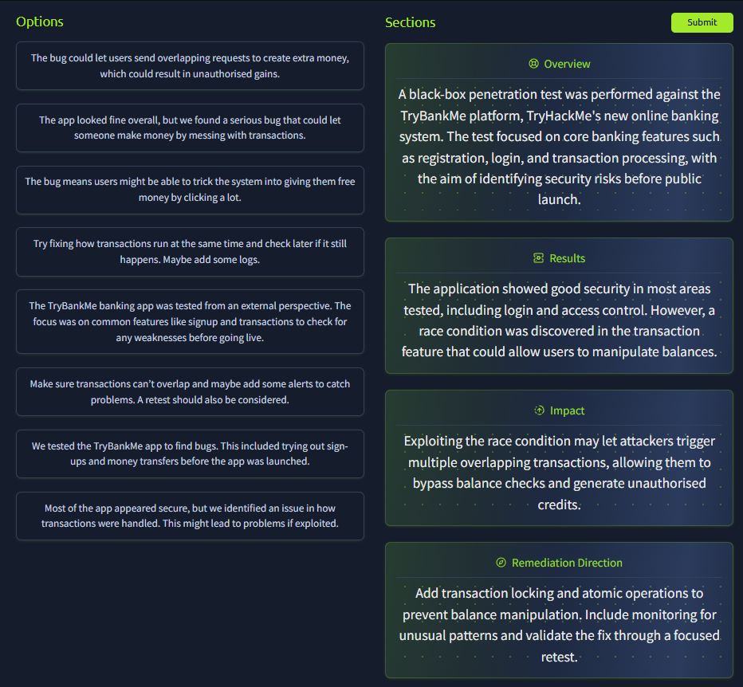
    
- Report Section 2: Vulnerability Write-Ups
    
    রিপোর্টের সবচেয়ে বড় অংশটি সাধারণত **vulnerability write-up**। প্রতিটি write-up-এ ব্যাখ্যা করা উচিত vulnerability কী, কোথায় পাওয়া গেছে, কীভাবে এটি আবিষ্কার করা হয়েছে এবং সবচেয়ে গুরুত্বপূর্ণভাবে—কীভাবে এটি সমাধান করা উচিত। এই অংশটি মূলত সেই স্টেকহোল্ডারদের জন্য লেখা হয় যারা সমস্যাগুলো ঠিক করবে, যেমন ডেভেলপার বা সিস্টেম অ্যাডমিনিস্ট্রেটর । তবে নিরাপত্তা বিশ্লেষক (security analysts) এবং প্রজেক্ট ম্যানেজাররাও এই অংশগুলো পর্যালোচনা করতে পারেন, যাতে remediation ট্র্যাক করা, সহায়তা প্রদান করা বা vulnerability-এর severity যাচাই করা যায়।
    
    ---
    
    ### একটি ভালো Write-Up এর কাঠামো (**Structure of a Good Write-Up)**
    
    আপনার write-up যেন পরিষ্কার এবং কার্যকর হয়, সেজন্য প্রতিটির জন্য একটি নির্দিষ্ট কাঠামো অনুসরণ করা উচিত। একটি কার্যকর ফরম্যাট হতে পারে:
    
    - **Title -** একটি ছোট এবং বর্ণনামূলক শিরোনাম।
        
        উদাহরণ: “Unauthenticated SQL Injection in Login Form”
        
    - **Risk Rating -** পাওয়া vulnerability-এর ঝুঁকির মাত্রা। প্রতিটি vulnerability সবসময় আলাদাভাবে মূল্যায়ন করা উচিত—যেন অন্য কোনো vulnerability নেই। এর জন্য ক্লায়েন্টের risk rating matrix অথবা কোনো পাবলিক স্ট্যান্ডার্ড যেমন **Common Vulnerability Scoring System** ব্যবহার করা যেতে পারে।
    - **Summary -** সহজ ভাষায় vulnerability এবং এর সম্ভাব্য প্রভাবের সংক্ষিপ্ত ব্যাখ্যা।
    - **Background -** vulnerability-টি কী এবং কেন এটি গুরুত্বপূর্ণ—এই বিষয়ে অতিরিক্ত প্রেক্ষাপট প্রদান করা। এটি বিশেষভাবে গুরুত্বপূর্ণ যদি পাঠক বিষয়টির সাথে পরিচিত না হন। মনে রাখতে হবে, যে ডেভেলপাররা vulnerability ঠিক করবে তারা সবসময় নিরাপত্তা বিশেষজ্ঞ নাও হতে পারে। তাই মূল কারণ (root cause) বোঝাতে অতিরিক্ত ব্যাখ্যা দিলে তারা সমস্যাটি সঠিকভাবে ঠিক করতে পারবে।
    - **Technical Details & Evidence -** কোথায় এবং কীভাবে সমস্যা পাওয়া গেছে। এখানে request, response, payload, screenshot বা code snippet অন্তর্ভুক্ত করা যেতে পারে।
    - **Impact -** এই vulnerability ব্যবহার করে একজন আক্রমণকারী বাস্তবে কী করতে পারে। এটি দেখায় যে আপনি শুধু vulnerability উল্লেখ করছেন না, বরং বাস্তব আক্রমণকারী কীভাবে এটি ব্যবহার করতে পারে সেটিও বিবেচনা করেছেন।
        
        উদাহরণ হিসেবে, XSS vulnerability থাকলে সাধারণত বলা হয় attacker ব্যবহারকারীর cookie চুরি করে session hijacking করতে পারে। কিন্তু যদি অ্যাপ্লিকেশন cookie এর পরিবর্তে token ব্যবহার করে, তাহলে সেই ক্ষেত্রে প্রভাব ভিন্ন হতে পারে। তাই সবসময় নির্দিষ্ট সিস্টেমের প্রেক্ষাপটে impact ব্যাখ্যা করতে হবে।
        
    - **Remediation Advice -** সমস্যা সমাধানের জন্য স্পষ্ট ও কার্যকর নির্দেশনা। এখানে নিশ্চিত করতে হবে যে সমাধানটি vulnerability-এর মূল কারণকে ঠিক করছে।
        
        উদাহরণ হিসেবে **SQL Injection**।
        
        Input validation বা sanitization কিছুটা সুরক্ষা দিতে পারে, কিন্তু মূল সমস্যাটি সমাধান করতে **parameterized queries** ব্যবহার করা জরুরি। এতে SQL command এবং ব্যবহারকারীর ইনপুট আলাদা থাকে এবং SQL engine বিভ্রান্ত হয় না।
        
        সুপারিশ দেওয়ার সময় নিশ্চিত করতে হবে যে সেটি vulnerability সম্পূর্ণভাবে সমাধান করবে, শুধু আংশিকভাবে প্রভাব কমাবে না। যদি অতিরিক্ত defense-in-depth ব্যবস্থা প্রস্তাব করা হয়, তবে উল্লেখ করতে হবে যে এগুলো একা ব্যবহার করলে সমস্যার মূল কারণ ঠিক হবে না।
        
    - **References (ঐচ্ছিক) -** সমাধান বাস্তবায়নের জন্য প্রাসঙ্গিক vendor documentation বা গাইডের লিংক।
    
    ---
    
    ### The Golden Thread
    
    এখানে আলাদা আলাদা section দেখানো হয়েছে, কিন্তু অভিজ্ঞতা বাড়লে রিপোর্ট লেখা অনেক স্বাভাবিক হয়ে যায়। তখন নির্দিষ্ট শিরোনাম ছাড়াও পুরো write-up এমনভাবে লেখা যায় যাতে একটি “golden thread” বা ধারাবাহিকতা থাকে—পাঠক সহজেই বুঝতে পারে সমস্যা কী, কেন হয়েছে এবং কী করতে হবে।
    
    তবে কিছু ক্ষেত্রে, যেমন vulnerability management software-এ রিপোর্ট ইমপোর্ট করার সময়, আলাদা section থাকা এখনও উপকারী। তাই রিপোর্টের কাঠামো ক্লায়েন্টের প্রয়োজন অনুযায়ী সামঞ্জস্য করা উচিত।
    
    ---
    
    ### Context খুব গুরুত্বপূর্ণ (**Context Matters)**
    
    আপনার রিপোর্ট কখনোই এমন মনে হওয়া উচিত নয় যে এটি কোনো বই বা অন্য ক্লায়েন্টের রিপোর্ট থেকে কপি করা হয়েছে। সবচেয়ে মূল্যবান রিপোর্ট হলো সেইগুলো যেখানে vulnerability-গুলো নির্দিষ্ট সিস্টেমের প্রেক্ষাপটে ব্যাখ্যা করা হয়।
    
    আপনার write-up-এ সাধারণত নিচের প্রশ্নগুলোর উত্তর থাকা উচিত:
    
    - ঠিক কোথায় vulnerability পাওয়া গেছে? (endpoint, parameter বা feature উল্লেখ করুন)
    - exploit করার জন্য কী কী শর্ত দরকার? (credential দরকার কি না, শুধু admin user-কে প্রভাবিত করে কি না ইত্যাদি)
    - ক্লায়েন্টের পরিবেশে এর প্রভাব কী? (যেমন হাসপাতালের ক্ষেত্রে patient data leak হতে পারে, ই-কমার্স সাইটে transaction প্রভাবিত হতে পারে)
    - ক্লায়েন্ট কীভাবে এটি ঠিক করবে? (যদি নির্দিষ্ট tech stack জানা থাকে, সেই অনুযায়ী সমাধান দিন)
    
    ### উদাহরণ: SQL Injection Write-Up
    
    **Title:** Unauthenticated SQL Injection in Login Form
    
    **Risk Rating:** High (CVSS 3.1 Base Score: 8.6)
    
    **Summary:** TryBankMe অ্যাপ্লিকেশনের login form-এ একটি unauthenticated SQL Injection vulnerability পাওয়া গেছে। এর মাধ্যমে attacker authentication bypass করতে পারে বা সংবেদনশীল গ্রাহক তথ্য বের করতে পারে।
    
    **Background:** SQL Injection তখন ঘটে যখন ব্যবহারকারীর ইনপুট নিরাপদভাবে parameterised না করে সরাসরি SQL query-তে ব্যবহার করা হয়। এতে SQL interpreter SQL command এবং user input আলাদা করতে পারে না, ফলে attacker SQL command-এর মধ্যে নিজের কোড ঢুকাতে পারে।
    
    **Technical Details & Evidence:**
    
    `/login` endpoint-এর `username` field-এ SQL Injection vulnerable ছিল।
    
    Burp Suite ব্যবহার করে নিচের HTTP request পরিবর্তন করা হয়েছিল:
    
    ```bash
    POST /login HTTP/1.1
    Host: trybankme.com
    Content-Type: application/x-www-form-urlencoded
    Content-Length: 45
    
    username=' OR 1=1--&password=randomvalue
    ```
    
    অ্যাপ্লিকেশনটি নিচের response দেয়:
    
    ```bash
    HTTP/1.1 302 Found
    Location: /dashboard
    Set-Cookie: sessionid=abc123xyz456; Path=/; HttpOnly
    ```
    
    এতে নিশ্চিত হয় যে authentication bypass হয়েছে।
    
    **Impact:**
    
    Attacker বৈধ credential ছাড়াই যেকোনো ব্যবহারকারী হিসেবে লগইন করতে পারে। এছাড়াও blind injection হওয়া সত্ত্বেও error-based injection ব্যবহার করে database থেকে তথ্য বের করা সম্ভব।
    
    **Remediation Advice:**
    
    ব্যবহারকারীর ইনপুট জড়িত সব database query-তে parameterised query ব্যবহার করা উচিত। উদাহরণস্বরূপ, .NET অ্যাপ্লিকেশনে MS SQL ব্যবহার করলে query এইভাবে লেখা উচিত:
    
    ```bash
    using (SqlConnection connection = new SqlConnection(connectionString))
    {
      string query = "SELECT * FROM Users WHERE Username = @username AND Password = @password";
      SqlCommand command = new SqlCommand(query, connection);
      command.Parameters.AddWithValue("@username", inputUsername);
      command.Parameters.AddWithValue("@password", inputPassword);
      connection.Open();
      SqlDataReader reader = command.ExecuteReader();
      if (reader.HasRows)
      {
          // Login successful
      }
    }
    ```
    
    এখানে user input এবং SQL command আলাদা রাখা হয়েছে, ফলে SQL engine বিভ্রান্ত হতে পারে না।
    
    **References:** [https://tryhackme.com/room/sqlinjectionlm](https://tryhackme.com/room/sqlinjectionlm)
    
    ---
    
    Vulnerability write-up অংশটি হলো সেই জায়গা যেখানে অধিকাংশ পাঠক—বিশেষ করে যারা সমস্যাগুলো ঠিক করবে—সবচেয়ে বেশি সময় ব্যয় করে। পরিষ্কার কাঠামো, শক্ত প্রমাণ এবং ব্যবহারযোগ্য সমাধানই একটি রিপোর্টকে গুরুত্বের সাথে নেওয়ার প্রধান কারণ।
    
    ---
    
    ### Write-Up Challenge
    
    এখন আপনার রিপোর্টিং দক্ষতা ব্যবহার করার সময়। TryBankMe-এর transaction system-এ পাওয়া **race condition vulnerability** নিয়ে একটি vulnerability write-up তৈরি করতে হবে।
    
    চ্যালেঞ্জ শুরু করতে **“View Site”** বাটনে ক্লিক করুন এবং রিপোর্ট তৈরি করুন।
    
    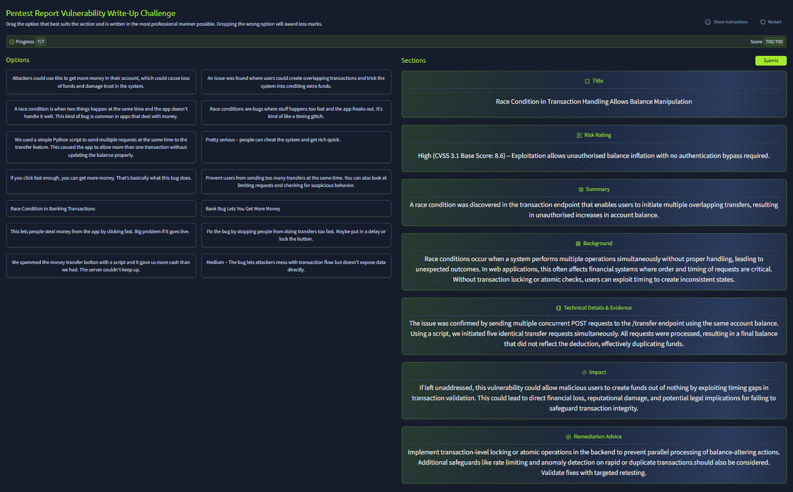
    
- Report Section 3: Appendices
    
    **Appendices** অংশটি বিশেষভাবে নিরাপত্তা স্টেকহোল্ডার এবং ভবিষ্যতের টেস্টারদের জন্য উপকারী। কারণ তারা পরে যাচাই করতে পারে যে কী কাজ করা হয়েছে, স্কোপ ঠিকভাবে অনুসরণ করা হয়েছে কি না, বা remediation-এর পর পুনরায় পরীক্ষা করার সময় কী কী বিষয় বিবেচনা করতে হবে। সাধারণত appendices-এর জন্য নির্দিষ্ট কোনো স্থির ফরম্যাট থাকে না এবং প্রকল্প অনুযায়ী এর কাঠামো ভিন্ন হতে পারে। তবে দুটি গুরুত্বপূর্ণ appendix সাধারণত রিপোর্টে রাখা উচিত।
    
    
    
    ## Assessment Scope
    
    Assessment Scope appendix-এর উদ্দেশ্য হলো দেখানো যে আসল **Rules of Engagement** ডকুমেন্টে যে স্কোপ নির্ধারণ করা হয়েছিল তার সাথে বাস্তবে করা টেস্ট কতটা মিলেছে। অনেক সময় প্রজেক্ট চলাকালে কিছু পরিবর্তন হতে পারে অথবা বিভিন্ন কারণে পুরো স্কোপ কভার করা সম্ভব হয় না।
    
    এই appendix-এ সেই তথ্যগুলো উল্লেখ করা হয়। এতে নিরাপত্তা স্টেকহোল্ডাররা পরবর্তী পদক্ষেপ সম্পর্কে ধারণা পায়। উদাহরণস্বরূপ, যদি আপনি পুরো স্কোপের মাত্র ৮০% পরীক্ষা করতে পারেন, তাহলে বাকি ২০% এর জন্য নতুন করে একটি সম্পূর্ণ reassessment করা প্রয়োজন হতে পারে—বিশেষ করে যদি প্রথম পরীক্ষায় অনেক vulnerability পাওয়া যায়।
    
    ## Assessment Artefacts
    
    Assessment Artefacts appendix-এ টেস্টিং চলাকালে আপনি যে পরিবর্তনগুলো করেছেন বা যে artefacts তৈরি হয়েছে সেগুলোর তালিকা দেওয়া হয়। যদিও একজন পেনেট্রেশন টেস্টার সবসময় চেষ্টা করে টেস্ট শেষে সবকিছু পরিষ্কার করে ফেলতে, বাস্তবে অনেক সময় সব artefact সম্পূর্ণভাবে মুছে ফেলা সম্ভব হয় না।
    
    এই তথ্যগুলো গুরুত্বপূর্ণ, কারণ কিছু artefact সম্ভাব্যভাবে ক্ষতিকরও হতে পারে। উদাহরণ হিসেবে ধরা যায়, আপনি যদি **unrestricted file upload vulnerability** ব্যবহার করে একটি **webshell** আপলোড করেন। সবচেয়ে খারাপ পরিস্থিতিতে, দুই বছর পরে সবাই সেই pentest এবং ফাইলটির কথা ভুলে যেতে পারে। পরে যখন কেউ ফাইলটি আবার খুঁজে পায়, তখন সেটিকে সত্যিকারের নিরাপত্তা ঘটনার (security incident) মতো মনে হতে পারে।
    
    এই appendix-এর মাধ্যমে আপনি সেই artefact-গুলো তালিকাভুক্ত করতে পারেন এবং কোনগুলো মুছে ফেলা উচিত ও কীভাবে মুছে ফেলতে হবে সে সম্পর্কে সুপারিশ দিতে পারেন।
    
    সংক্ষেপে, appendices-কে আপনার **audit trail** হিসেবে ভাবা যায়। এটি দেখায় আপনি কী কাজ করেছেন, আপনার ফলাফলকে সমর্থন করে এবং ভবিষ্যতে প্রয়োজন হলে সেই তথ্যের ভিত্তিতে পরবর্তী পদক্ষেপ নেওয়ার সুযোগ দেয়—even অনেক বছর পরেও যখন মূল assessment শেষ হয়ে গেছে।
    
- Styling Guides and Report QA
    
    রিপোর্ট লেখা শুধু কাগজে তথ্য লিখে দেওয়া নয়; বরং সেই তথ্যকে পরিষ্কার, নিরপেক্ষ এবং পেশাদারভাবে উপস্থাপন করার বিষয়। পেনেট্রেশন টেস্টের পুরো কাজের মধ্যে রিপোর্টই একমাত্র জিনিস যা দীর্ঘ সময় ধরে টিকে থাকে। অনেক বছর পরে যখন আপনি অন্য কোনো কাজে চলে যাবেন বা পুরো প্রজেক্ট টিম বদলে যাবে, তখনও এই রিপোর্টটি প্রাসঙ্গিক থাকবে।
    
    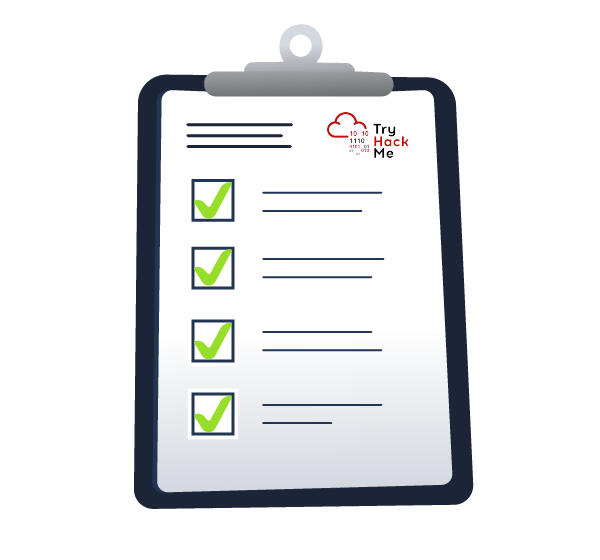
    
    ## পরিষ্কারভাবে লেখা (Writing Clearly)
    
    একটি ভালো রিপোর্টের সবচেয়ে গুরুত্বপূর্ণ গুণগুলোর একটি হলো **স্বচ্ছতা (clarity)**। সবসময় এমনভাবে লিখতে হবে যাতে কোনো ধরনের অস্পষ্টতা না থাকে। সহজ এবং সরাসরি ভাষা ব্যবহার করা উচিত, যাতে আপনার বক্তব্য পরিষ্কারভাবে বোঝা যায়।
    
    আপনার লেখা এমন হওয়া উচিত যাতে সেই পাঠকরাও বুঝতে পারে যাদের সিস্টেম সম্পর্কে গভীর টেকনিক্যাল জ্ঞান নেই। যদি আপনার বক্তব্য অস্পষ্ট হয় বা অপ্রয়োজনীয় জটিল ভাষার মধ্যে লুকিয়ে থাকে, তাহলে আপনার খুঁজে পাওয়া সমস্যাগুলো হয়তো গুরুত্ব পাবে না বা ঠিকও করা হবে না।
    
    ## পেশাদার লেখার ধরন (Professional Writing)
    
    একটি পেনেট্রেশন টেস্ট রিপোর্ট একটি **আনুষ্ঠানিক (formal)** ডকুমেন্ট। তাই এটি এমনভাবে লেখা উচিত যেমন অন্য কোনো গুরুত্বপূর্ণ ব্যবসায়িক যোগাযোগ লেখা হয়।
    
    এর অর্থ হলো:
    
    **নিরপেক্ষ থাকুন (Be objective)**
    
    শুধু তথ্য উপস্থাপন করুন। অতিরঞ্জন, আবেগপূর্ণ ভাষা বা কারও উদ্দেশ্য সম্পর্কে অনুমান করা থেকে বিরত থাকুন।
    
    **অপ্রাতিষ্ঠানিক লেখা এড়িয়ে চলুন (Avoid informal writing)**
    
    স্ল্যাং, মজা বা অপ্রাতিষ্ঠানিক বাক্য ব্যবহার করবেন না। যেমন “we pwned the login page” এর মতো বাক্য ব্যবহার করা উচিত নয়।
    
    **একই ধরনের ব্যবহার বজায় রাখুন (Be consistent)**
    
    রিপোর্ট জুড়ে একই ধরনের শব্দ, ফরম্যাট এবং কাঠামো ব্যবহার করুন। একই বিষয় বোঝাতে ভিন্ন ভিন্ন শব্দ বা বানান ব্যবহার করা এড়িয়ে চলুন।
    
    ## সাধারণ ভালো চর্চা (General Best Practices)
    
    আপনার লেখাকে আরও পেশাদার ও সহজপাঠ্য করার জন্য কিছু নিয়ম অনুসরণ করা উচিত:
    
    **অতীত কাল ব্যবহার করুন (Write in past tense)**
    
    উদাহরণ:
    
    “Authentication testing-এর সময় vulnerability আবিষ্কৃত হয়েছিল।”
    
    **প্রথম পুরুষ ব্যবহার করবেন না (Do not use first-person language)**
    
    “I”, “we”, “our”, “us” এর মতো শব্দ ব্যবহার এড়িয়ে চলুন। নিরপেক্ষ পর্যবেক্ষকের মতো লিখুন।
    
    **সংবেদনশীল তথ্য গোপন রাখুন (Mask sensitive information)**
    
    বাস্তব পাসওয়ার্ড বা ব্যক্তিগত তথ্য কখনো রিপোর্টে উল্লেখ করবেন না, যদি না বিশেষভাবে অনুমতি দেওয়া হয়। যদি vulnerability-এর প্রভাব দেখানোর জন্য screenshot ব্যবহার করেন, তাহলে সংবেদনশীল তথ্য blur করে দিন।
    
    **পরিষ্কার ও আনুষ্ঠানিক ভাষা ব্যবহার করুন (Use clean, formal phrasing)**
    
    অত্যন্ত সাধারণ বা কথ্য ভাষা ব্যবহার করবেন না।
    
    যেমন:
    
    “The attacker gained unauthorised access”
    
    এই বাক্যটি “we broke in” বলার চেয়ে বেশি পেশাদার।
    
    ## Quality Assurance (QA) প্রক্রিয়া
    
    অভিজ্ঞ টেস্টাররাও ভুল করতে পারে। তাই প্রতিটি রিপোর্ট একটি সঠিক **review process**-এর মধ্য দিয়ে যাওয়া উচিত।
    
    **নিজের লেখা নিজে পড়ুন (Read your own work)**
    
    কিছু সময় বিরতি নিয়ে আবার রিপোর্টটি পড়ুন। এতে অস্পষ্ট বাক্য, অসঙ্গতি বা অনুপস্থিত তথ্য সহজে ধরা পড়ে। অনেক সময় নিজের লেখা জোরে পড়লে ভুলগুলো আরও সহজে বোঝা যায়।
    
    **অন্য কাউকে দিয়ে পড়ান (Peer review)**
    
    একজন সহকর্মী বা reviewer আপনার রিপোর্ট পড়ে দেখবে যে আপনার ফলাফলগুলো বোঝা সহজ কি না, বাস্তবায়নযোগ্য কি না এবং পেশাদারভাবে লেখা হয়েছে কি না।
    
    QA শুধু বানান বা টাইপো ঠিক করার জন্য নয়। এর উদ্দেশ্য হলো নিশ্চিত করা যে রিপোর্টটি আপনার এবং আপনার পেনেটেস্টিং টিমের পেশাদার মানকে সঠিকভাবে উপস্থাপন করছে।
    
    আপনার টেকনিক্যাল ফলাফল যত ভালোই হোক না কেন, যদি রিপোর্টটি এলোমেলো, আবেগপূর্ণ, অসঙ্গত বা অস্পষ্ট হয়, তাহলে সেটি তার প্রাপ্য গুরুত্ব পাবে না। ভালো লেখা ভালো নিরাপত্তা কাজকে যথাযথ গুরুত্ব পেতে সাহায্য করে।
    
    ## QA Challenge
    
    এখন আপনি কী কী বিষয় লক্ষ্য করতে হবে তা বুঝেছেন। **View Site** বাটনে ক্লিক করে QA Challenge শুরু করুন।
    
    এই চ্যালেঞ্জে আপনাকে একটি appendix QA করতে হবে যেখানে পাঁচটি ভুল রয়েছে। সেই পাঁচটি ভুল চিহ্নিত করতে হবে এবং সঠিক কারণ উল্লেখ করতে হবে, তাহলেই আপনি আপনার flag পাবেন।
    
    ---
    
    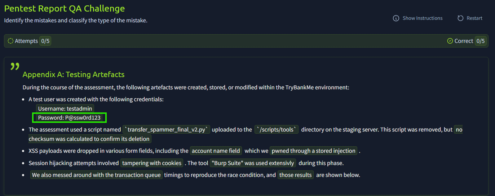
    
    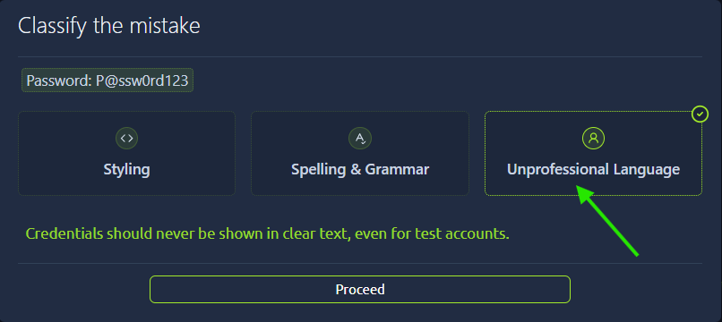
    
    ---
    
    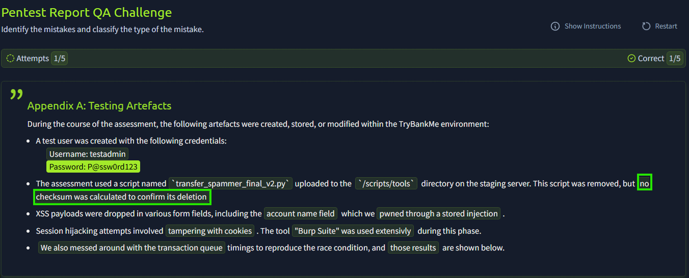
    
    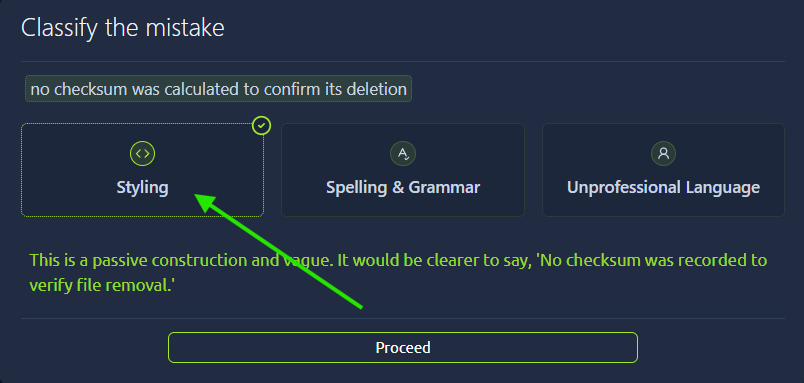
    
    ---
    
    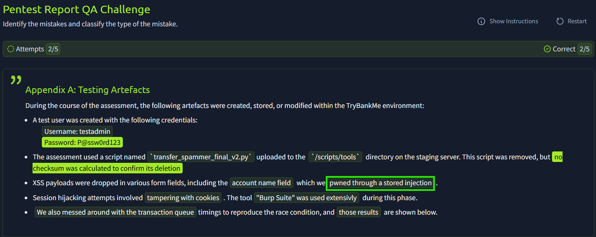
    
    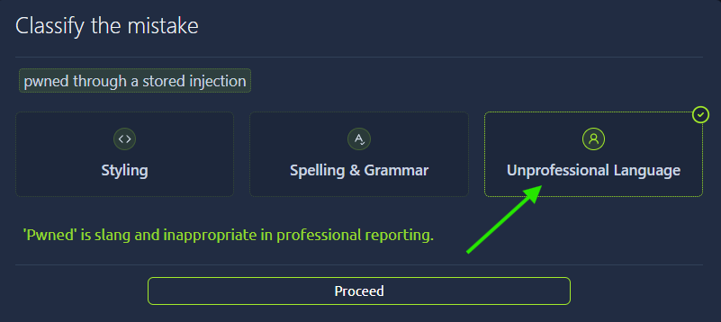
    
    ---
    
    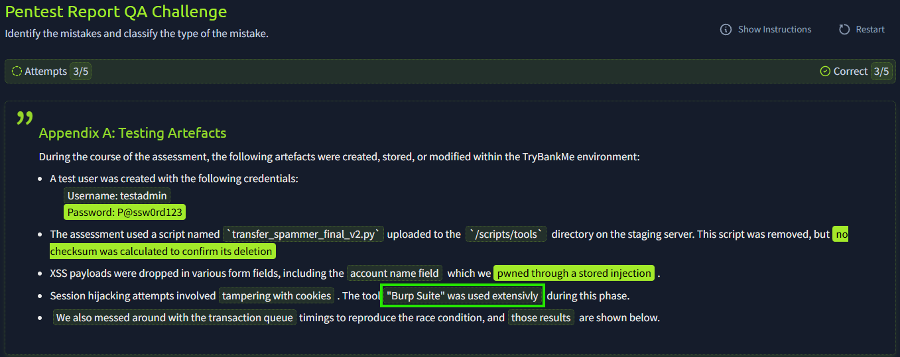
    
    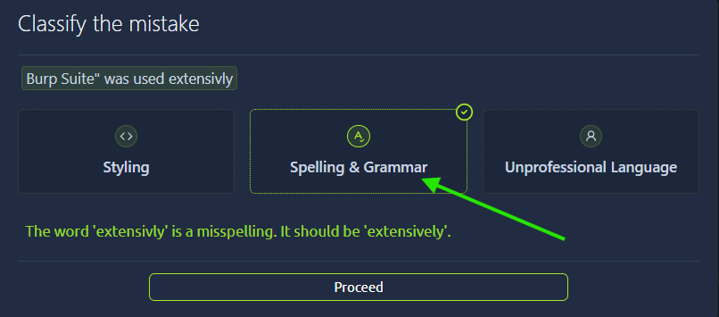
    
    ---
    
    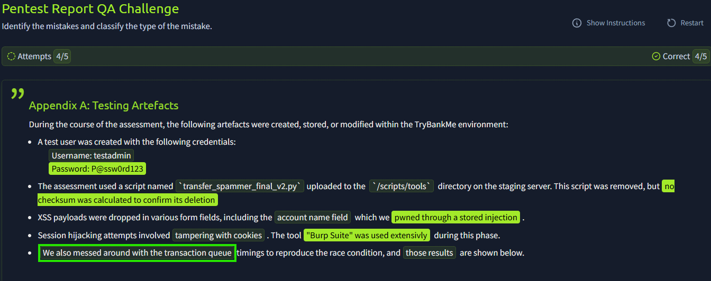
    
    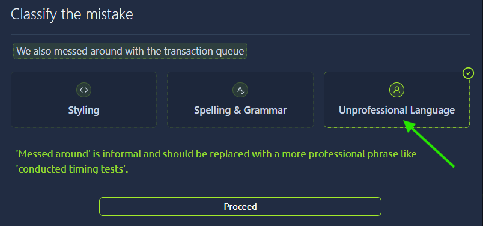
    
    ---
    
    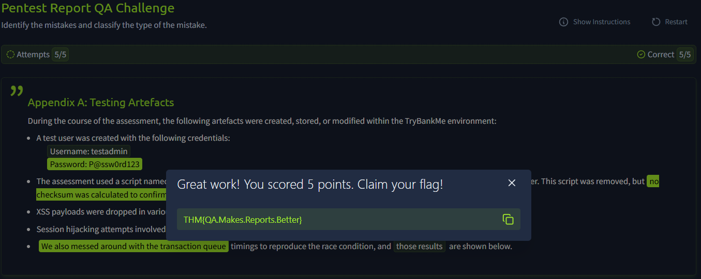
    
- Conclusion
    
    ## রিপোর্ট প্রকাশ করা (Publishing the Report)
    
    পেশাদার পেনেট্রেশন টেস্ট রিপোর্ট লেখা vulnerability খুঁজে বের করার মতোই গুরুত্বপূর্ণ। একটি পরিষ্কার, সুশৃঙ্খল এবং ভালোভাবে লেখা রিপোর্টই আপনার অ্যাসেসমেন্টের চূড়ান্ত ফলাফল এবং অনেক সময় এটিই একমাত্র স্থায়ী প্রমাণ যে কাজটি করা হয়েছে।
    
    এই অংশে আপনি শিখেছেন কীভাবে:
    
    - বিভিন্ন ধরনের পাঠকের প্রয়োজন অনুযায়ী রিপোর্টের কাঠামো তৈরি করতে হয়
    - এমন একটি কার্যকর সারসংক্ষেপ (summary) লিখতে হয় যা ব্যবসায়িক ঝুঁকি পরিষ্কারভাবে বোঝায়
    - বিস্তারিত এবং প্রাসঙ্গিক vulnerability write-up তৈরি করতে হয়
    - ক্লায়েন্টের পরিবেশ অনুযায়ী স্পষ্ট remediation নির্দেশনা দিতে হয়
    - লেখায় স্বচ্ছতা, নিরপেক্ষতা এবং পেশাদারিত্ব বজায় রাখতে হয়
    - quality assurance (QA) প্রক্রিয়া ব্যবহার করে নিশ্চিত করতে হয় যে রিপোর্টটি প্রকাশের জন্য প্রস্তুত
    
    ## শেষ কথা (Final Thoughts)
    
    ভালো রিপোর্টিং আপনার খুঁজে পাওয়া সমস্যাগুলোকে বাস্তব প্রভাব তৈরি করতে সাহায্য করে। এটি টেকনিক্যাল তথ্যকে বাস্তব পদক্ষেপে রূপান্তর করে এবং প্রতিষ্ঠানকে তাদের নিরাপত্তা ব্যবস্থা উন্নত করার জন্য প্রয়োজনীয় ধারণা দেয়।
    
    তাই রিপোর্ট লেখার জন্য যথেষ্ট সময় দিন — কারণ রিপোর্টে যদি কোনো বিষয় উল্লেখ না থাকে, তাহলে সেটি **ঘটেনি বলেই ধরা হবে**।