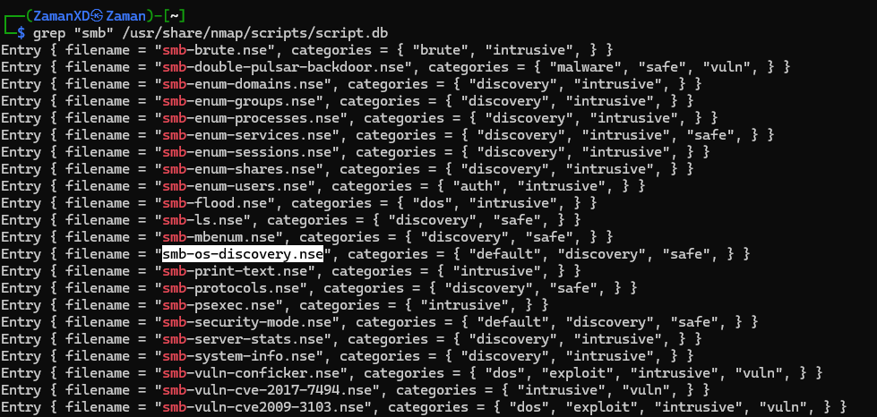
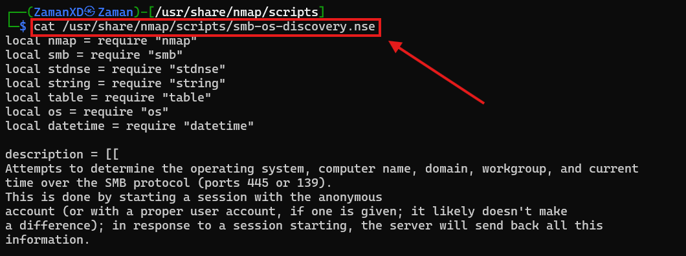
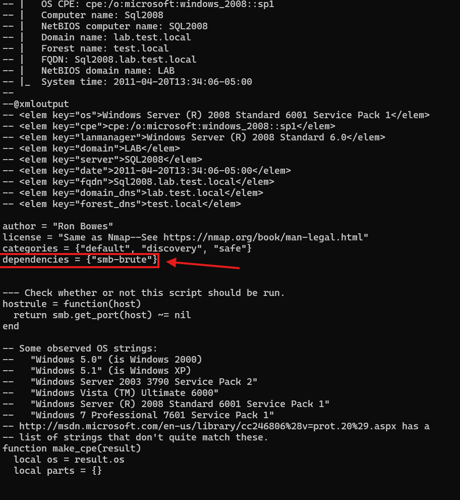
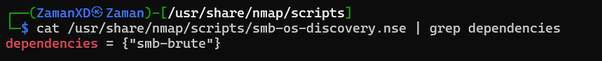

# (NSE Scripts) Searching for Scripts

আমরা এখন জানি Nmap-এ script কীভাবে ব্যবহার করতে হয়, কিন্তু এখনো জানি না কীভাবে এই script গুলো খুঁজে বের করতে হয়।

এটির জন্য মূলত দুইটি উপায় আছে, এবং ভালো ফল পাওয়ার জন্য সাধারণত এই দুইটি একসাথে ব্যবহার করা উচিত:

প্রথমটি হলো [Nmap](https://nmap.org/nsedoc/)-এর অফিসিয়াল ওয়েবসাইট, যেখানে সব official script-এর একটি তালিকা থাকে।

দ্বিতীয়টি হলো আপনার attacking machine-এর local storage।

Linux-এ Nmap তার script গুলো সাধারণত এই directory-তে রাখে: 

```bash
/usr/share/nmap/scripts
```

এখানেই সব NSE script default-ভাবে থাকে, এবং Nmap এখান থেকেই script load করে যখন আপনি কোনো script specify করেন।

ইনস্টল করা script খোঁজার জন্য দুইটি পদ্ধতি আছে:

- প্রথম পদ্ধতি: db ফাইল ব্যবহার করা।
    
    ```bash
    /usr/share/nmap/scripts/script.db
    ```
    
    নামের শেষে `.db` থাকলেও এটি আসলে কোনো database না; বরং এটি একটি formatted text file, যেখানে প্রতিটি script-এর filename এবং category তালিকাভুক্ত থাকে।
    
    
    
    Nmap এই ফাইল ব্যবহার করে script track করতে, তবে আমরা এটিকে `grep` দিয়ে search করতেও পারি। যেমন: 
    
    ```bash
    grep "ftp" /usr/share/nmap/scripts/script.db
    ```
    
    
    
- দ্বিতীয় পদ্ধতি:
    
    সরাসরি `ls` command ব্যবহার করা। যেমন: 
    
    ```bash
    ls -l /usr/share/nmap/scripts/*ftp*
    ```
    
    
    
    এখানে লক্ষ্য করুন, search term-এর আগে ও পরে asterisk (`*`) ব্যবহার করা হয়েছে—এটি wildcard হিসেবে কাজ করে।
    

একইভাবে category দিয়েও search করা যায়। যেমন:

```bash
grep "safe" /usr/share/nmap/scripts/script.db
```

---

- নতুন script ইনস্টল করা:
    
    যদি Nmap-এর অফিসিয়াল তালিকায় কোনো script থাকে কিন্তু আপনার local system-এ না থাকে, তাহলে সাধারণত নিচের command চালালেই ঠিক হয়ে যায়:
    
    ```bash
    sudo apt update && sudo apt install nmap
    ```
    
- তবে চাইলে manually script install করাও সম্ভব। উদাহরণ:
    
    ```bash
    sudo wget -O /usr/share/nmap/scripts/<script-name>.nse https://svn.nmap.org/nmap/scripts/<script-name>.nse
    ```
    
- এরপর অবশ্যই চালাতে হবে:
    
    ```bash
    nmap --script-updatedb
    ```
    
    এটি script.db ফাইল আপডেট করে, যাতে নতুন script-টি Nmap চিনতে পারে।
    

এখানে উল্লেখযোগ্য যে, আপনি যদি নিজে কোনো NSE script তৈরি করে Nmap-এ যুক্ত করেন, তাহলেও একই **`nmap --script-updatedb`** কমান্ড চালাতে হবে। আর কিছুটা Lua programming-এর মৌলিক জ্ঞান থাকলেই এই কাজটি করা বেশ সহজ ও পরিচালনাযোগ্য।

---

- `/usr/share/nmap/scripts/` directory-তে দেখানো যেকোনো একটি পদ্ধতি ব্যবহার করে "smb" script খুঁজুন। SMB server-এর underlying OS নির্ধারণ করে এমন script-এর filename কী?
    
    **smb-os-discovery.nse**
    
    
    
- এই script-টি পড়ে দেখুন। এটি কোন script-এর উপর নির্ভর করে?
    
    **smb-brute**
    
    
    
    > Scroll to down and read the script
    > 
    
    
    
    > OR
    > 
    
    