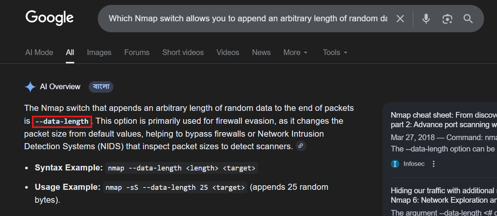

# Firewall Evasion

আমরা ইতিমধ্যে firewall bypass করার কিছু technique দেখেছি (যেমন: stealth scan, NULL, FIN এবং Xmas scan)। তবে আরও একটি খুব সাধারণ firewall configuration আছে, যেটি bypass করা জানা অত্যন্ত গুরুত্বপূর্ণ।

সাধারণত একটি default configuration-এ থাকা Windows host সব **ICMP packet block** করে। এতে একটি সমস্যা তৈরি হয়: আমরা যেমন ping ব্যবহার করে target alive কিনা যাচাই করি, Nmap-ও default-ভাবে একই কাজ করে। ফলে এই ধরনের firewall থাকলে Nmap host-টিকে dead হিসেবে ধরে নেয় এবং সেটি scan-ই করে না।

এই সমস্যার সমাধান হিসেবে Nmap একটি option দেয়: **`-Pn`**

এটি Nmap-কে বলে দেয় scan শুরু করার আগে ping (ICMP check) না করতে। ফলে Nmap সব target host-কে alive ধরে নিয়ে scan করে, যা ICMP block bypass করতে সাহায্য করে। তবে এর downside হলো—যদি host আসলেই dead হয়, তবুও Nmap প্রতিটি port check করতে থাকবে, ফলে scan সম্পন্ন হতে অনেক বেশি সময় লাগতে পারে।

উল্লেখ্য, যদি আপনি একই local network-এ থাকেন, তাহলে Nmap host alive কিনা বোঝার জন্য **ARP request**-ও ব্যবহার করতে পারে।

---

Firewall evasion-এর জন্য Nmap-এ আরও কিছু useful switch আছে। যেগুলোর মধ্যে [এখানে](https://nmap.org/book/man-bypass-firewalls-ids.html) পাওয়া যাবে।

 এখানে সেগুলোর মধ্যে গুরুত্বপূর্ণ কয়েকটি উল্লেখ করা হলো:

- **`f`**: packet fragment করে (ছোট ছোট অংশে ভাগ করে) পাঠায়, যাতে firewall বা IDS-এর জন্য detect করা কঠিন হয়।
- **`--mtu <number>`** : packet-এর size control করার জন্য ব্যবহার করা হয়। এটি `-f`  এর বিকল্প, তবে বেশি control দেয়। (value অবশ্যই 8-এর multiple হতে হবে)
- **`--scan-delay <time>ms`**: প্রতিটি packet পাঠানোর মাঝে delay যোগ করে। এটি unstable network-এ সহায়ক, এবং time-based firewall/IDS detection bypass করতেও কাজে লাগে।
- **`--badsum`**: ইচ্ছাকৃতভাবে invalid checksum-সহ packet তৈরি করে। সাধারণ TCP/IP stack এই packet drop করে, কিন্তু firewall কখনও কখনও checksum যাচাই না করেই response দিতে পারে। এর মাধ্যমে firewall বা IDS-এর উপস্থিতি শনাক্ত করা যায়।

---

- কোন সাধারণ (এবং প্রায়ই ব্যবহৃত) protocol অনেক সময় block করা হয়, যার কারণে **-Pn** switch ব্যবহার করতে হয়?
    
    > **ICMP**
    > 
- [Research] কোন Nmap switch packet-এর শেষে arbitrary length-এর random data যোগ করতে দেয়?
    
    > **--data-length**
    > 
    
    