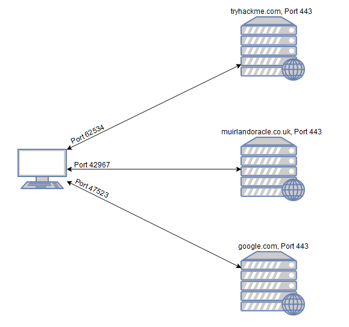

# Intoduction

হ্যাকিংয়ের ক্ষেত্রে **জ্ঞানই শক্তি**। কোনো টার্গেট সিস্টেম বা নেটওয়ার্ক সম্পর্কে যত বেশি তথ্য জানা যায়, তত বেশি উপায় পাওয়া যায় সেটিকে বিশ্লেষণ বা আক্রমণ করার। তাই কোনো ধরনের exploitation (দুর্বলতা কাজে লাগানো) করার আগে সঠিকভাবে **enumeration** করা খুবই জরুরি।

ধরুন আমাদেরকে একটি বা একাধিক **IP address** দেওয়া হয়েছে নিরাপত্তা পরীক্ষা (security audit) করার জন্য। তখন প্রথম কাজ হলো আমরা যে সিস্টেমগুলোর উপর কাজ করছি সেগুলোর **“ল্যান্ডস্কেপ” বা সামগ্রিক অবস্থা** বোঝা। সহজভাবে বলতে গেলে, টার্গেট মেশিনগুলোতে **কোন কোন সার্ভিস চলছে** সেটা বের করা।

উদাহরণ হিসেবে:

- কোনো একটি সার্ভারে হয়তো **web server** চলছে।
- আরেকটি সার্ভার হয়তো **Windows Active Directory Domain Controller** হিসেবে কাজ করছে।

এই পুরো নেটওয়ার্কের একটি মানচিত্র বা ধারণা পাওয়ার প্রথম ধাপকে বলা হয় **port scanning**।

### Port কী?

যখন কোনো কম্পিউটার একটি নেটওয়ার্ক সার্ভিস চালায়, তখন সেটি একটি **port** খুলে রাখে যাতে অন্য কম্পিউটার সেখানে সংযোগ করতে পারে।

**Port খুব গুরুত্বপূর্ণ**, কারণ এগুলোর মাধ্যমে একটি কম্পিউটার একসাথে অনেক নেটওয়ার্ক অনুরোধ (request) বা বিভিন্ন সার্ভিস পরিচালনা করতে পারে।

### একটি সহজ উদাহরণ

ধরুন আপনি ব্রাউজারে একসাথে কয়েকটি ওয়েবপেজ খুলেছেন। তখন ব্রাউজারকে বুঝতে হবে কোন ট্যাব কোন ওয়েবপেজ লোড করছে। এজন্য আপনার কম্পিউটার বিভিন্ন **local port** ব্যবহার করে আলাদা আলাদা সংযোগ তৈরি করে।

আর যদি কোনো সার্ভার একাধিক সার্ভিস চালাতে চায়, যেমন:

- **HTTP (port 80)**
- **HTTPS (port 443)**

তাহলে এই সার্ভিসগুলোকে আলাদা করতে **port** ব্যবহার করা হয়, যাতে সঠিক ট্রাফিক সঠিক সার্ভিসে যায়।

### সংযোগ কীভাবে হয়?

একটি নেটওয়ার্ক সংযোগ সাধারণত দুইটি পোর্টের মধ্যে তৈরি হয়:

1. সার্ভারের একটি **open port** (যেটা সংযোগের জন্য অপেক্ষা করে)
2. আপনার কম্পিউটারের একটি **random port**

উদাহরণ:

আপনি যখন কোনো ওয়েবসাইটে ঢোকেন, তখন আপনার কম্পিউটার হয়তো **port 49534** ব্যবহার করে সার্ভারের **port 443 (HTTPS)** এর সাথে সংযোগ স্থাপন করে।

---

আগের উদাহরণের মতো, এই ডায়াগ্রামটি দেখায় যখন আপনি একসাথে অনেকগুলো ওয়েবসাইটে সংযোগ করেন তখন কী ঘটে। আপনার কম্পিউটার তখন একটি **ভিন্ন উচ্চ নম্বরের পোর্ট (randomভাবে)** খুলে, এবং সেই পোর্ট ব্যবহার করে দূরের সার্ভারের সাথে সব যোগাযোগ করে।

প্রতিটি কম্পিউটারে মোট **৬৫,৫৩৫টি পোর্ট** থাকে। তবে এর মধ্যে অনেকগুলো পোর্ট নির্দিষ্ট কাজের জন্য **স্ট্যান্ডার্ড পোর্ট হিসেবে রেজিস্টার করা** থাকে। উদাহরণস্বরূপ:

- **HTTP Webservice** সাধারণত সার্ভারের **port 80**এ থাকে
- **HTTPS Webservice** সাধারণত **port 443**এ থাকে
- **Windows NETBIOS** থাকে **port 139**এ
- **SMB** থাকে **port 445**এ

তবে একটা গুরুত্বপূর্ণ বিষয় হলো—বিশেষ করে **CTF (Capture The Flag)** ধরনের সাইবার সিকিউরিটি চ্যালেঞ্জে—এই স্ট্যান্ডার্ড পোর্টগুলো অনেক সময় **পরিবর্তন করে রাখা হয়**। তাই টার্গেট সিস্টেমে কোন পোর্টে কোন সার্ভিস চলছে তা খুঁজে বের করার জন্য **সঠিকভাবে enumeration (তথ্য সংগ্রহ)** করা খুবই জরুরি।

যদি আমরা না জানি যে কোনো সার্ভারে **কোন কোন পোর্ট খোলা আছে**, তাহলে সেই টার্গেটের উপর সফলভাবে আক্রমণ করার আশা করা কঠিন। এজন্যই যেকোনো আক্রমণ শুরু করার আগে **port scan করা অত্যন্ত গুরুত্বপূর্ণ**।

এই কাজটি বিভিন্ন উপায়ে করা যায়, তবে সাধারণত একটি টুল ব্যবহার করা হয় যার নাম **Nmap**। এই টুলটাই এই অধ্যায়ের মূল বিষয়।

**Nmap** দিয়ে অনেক ধরনের port scan করা যায়। সামনে আমরা এর কিছু সাধারণ স্ক্যানের ধরন দেখবো। তবে মূল ধারণাটি হলো:

Nmap টার্গেটের প্রতিটি পোর্টে একে একে সংযোগ করার চেষ্টা করে। পোর্ট কীভাবে প্রতিক্রিয়া দেয় তার উপর ভিত্তি করে বোঝা যায় যে পোর্টটি:

- **Open (খোলা)**
- **Closed (বন্ধ)**
- **Filtered (সাধারণত ফায়ারওয়াল দ্বারা ব্লক করা)**

যখন আমরা জানতে পারি কোন পোর্টগুলো খোলা আছে, তখন আমরা খুঁজে বের করতে পারি সেই পোর্টে **কোন সার্ভিস চলছে**। এটা আমরা হাতে করে করতে পারি, তবে বেশিরভাগ সময় **Nmap নিজেই এই কাজ করে দেয়**।

এখন প্রশ্ন হলো — **কেন Nmap ব্যবহার করা হয়?**

সংক্ষেপে বললে, এটি বর্তমানে **ইন্ডাস্ট্রির স্ট্যান্ডার্ড টুল**। অন্য কোনো port scanning টুল এর মতো এত ফিচার দেয় না (যদিও কিছু নতুন টুল গতি বা speed-এর ক্ষেত্রে প্রতিযোগিতা করছে)।

Nmap একটি **অত্যন্ত শক্তিশালী টুল**। এর ক্ষমতা আরও বাড়ে এর **scripting engine**-এর কারণে। এই স্ক্রিপ্ট ব্যবহার করে:

- সম্ভাব্য **vulnerability (দুর্বলতা)** খুঁজে বের করা যায়
- কিছু ক্ষেত্রে সরাসরি **exploit** করাও সম্ভব

এই বিষয়গুলো সামনে বিস্তারিত আলোচনা করা হবে।

এই মুহূর্তে আপনার তিনটি বিষয় পরিষ্কারভাবে বোঝা দরকার:

1. **Port scanning কী**
2. **এটা কেন দরকার**
3. **যেকোনো প্রাথমিক enumeration-এর জন্য Nmap সবচেয়ে জনপ্রিয় ও কার্যকর টুল**

---