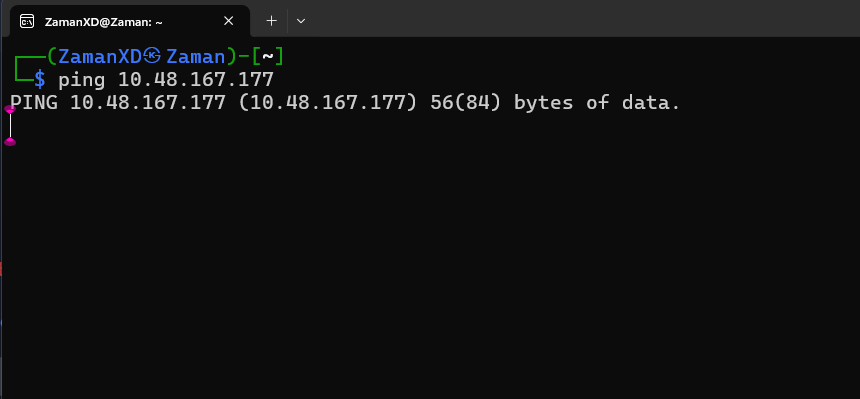
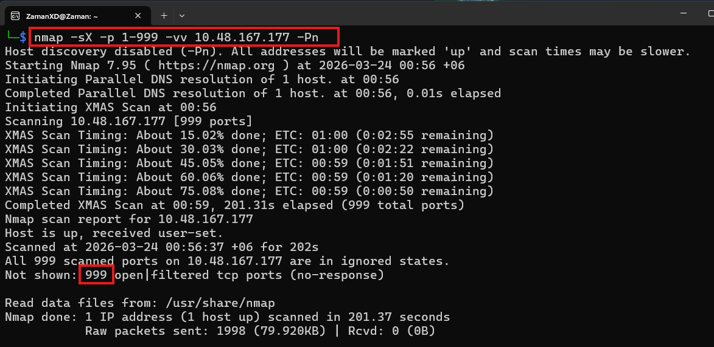
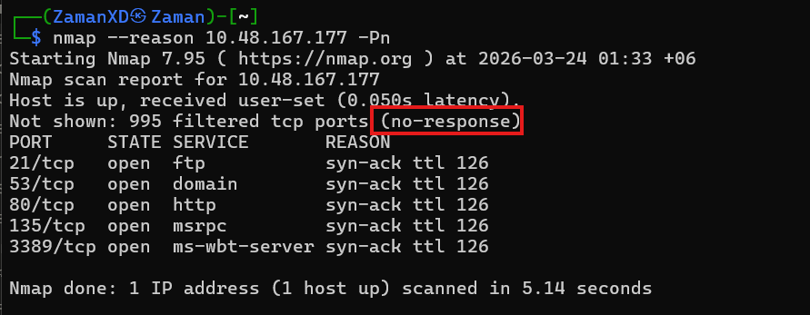
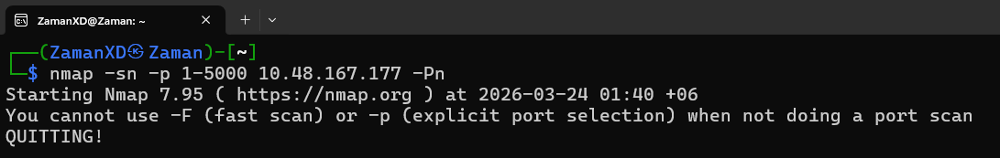
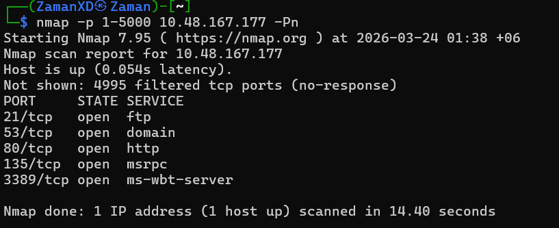

# Practice

- **Does the target ip respond to ICMP echo (ping) requests (Y/N)?**
    
    > N
    > 
    
    
    
- **Perform an Xmas scan on the first 999 ports of the target -- how many ports are shown to be open or filtered?**
    
    > 999
    > 
    
    
    
- **There is a reason given for this -- what is it?**
    
    <aside>
    ⚠️
    
    **Note:** The answer will be in your scan results. Think carefully about which switches to use -- and read the hint before asking for help!
    
    </aside>
    
    > No Response
    > 
    
    
    
- **Perform a TCP SYN scan on the first 5000 ports of the target -- how many ports are shown to be open?**
    
    
    
    <aside>
    ⚠️
    
    > This is wrong cause `-sn` stops the port scan that’s why this error shows
    > 
    </aside>
    
    
    
    > 5
    > 
    
    <aside>
    ⚠️
    
    > Nmap by default scans TCP SYN scan but when nmap runs on root then it perform TCP connect scan. But if flag was defined `-sn` then it will disabled the port scan and shows only host is up or down.
    > 
    </aside>
    
- Open Wireshark (see [Cryillic's](https://tryhackme.com/p/Cryillic) [Wireshark Room](https://tryhackme.com/room/wireshark) for instructions) and perform a TCP Connect scan against port 80 on the target, monitoring the results. Make sure you understand what's going on. Deploy the `ftp-anon` script against the box. Can Nmap login successfully to the FTP server on port 21? (Y/N)
    
    > Y
    >